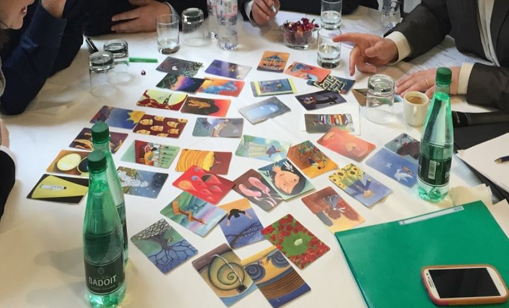

# MATRICE DIXIT

**Catégorie:** Briser la glace · **Phase:** Ouverture · **Difficulté:** Facile · **Durée:** 30' · **Participants:** 10-50

## Objectif

Partager sous forme imagée la perception d'un groupe, d'un projet.

## Valeur ajoutée

Permet d'engager les échanges avant un atelier de type "matrice des attendus" ou "matrice RACI".

## Résumé de la pratique

Inviter les participants à choisir des cartes DIXIT qui représentent le mieux son groupe et les autres groupes.

## Materiel

- Brown paper
- Jeux de cartes "DIXIT"
- Patafix.

## Déroulé de l'atelier

### Préparation de la matrice *(5')*
Dessiner une matrice carrée de n acteurs (un acteur étant une équipe, un service, une direction) sur un brown paper. Composer les groupes. Chaque groupe réprésente un acteur.

### Sélection des cartes par groupe *(10')*
Chaque groupe choisit une carte du jeu " DIXIT " qui représente le mieux son groupe et les autres groupes.

### Partage *(15')*
Un rapporteur par groupe vient positionner les cartes à l'aide de la patafix sur la matrice et explique aux autres ce qu'elles représentent. Un échange peut alors avoir lieu.

Cette pratique est parfois appelée parfois "Matrice des préjugés"

## Point de vigilance

**Nombre de groupes limité à 5** : Un grand nombre de groupes peut rallonger inutilement l'activité, ce qui pourrait nuire à son objectif premier : briser la glace.  5 groupes = 25 cartes à débriefer...

**Constituer des groupes homogènes et d'au moins 3 personnes** : Ceci permet d'éviter que les réponses soient trop directement associées à une personne en particulier, favorisant ainsi une dynamique de groupe plus équilibrée.

**Cadre de bienveillance** : En tant que facilitateur, il est essentiel de rappeler que l'exercice doit être pratiqué dans un esprit de bienveillance. Il ne doit pas devenir un prétexte pour critiquer ou dénigrer un service ou une personne.

## Variante

Vous pouvez également utiliser les cartes DIXIT pour faire du photolangage..  Par exemple

Demander aux participants de donner leur impression sur l'ordre du jour de l'atelier ou tout simplement le projet. Lors d'un bilan (ou rétrospective), vous pouvez demander de choisir une carte qui représente le mieux ce qui s'est bien passé et une autre carte qui réprésente le mieux ce qui s'est moins bien passé.

## Source

Illustration Marie Cardouat. Les cartes DIXIT sont éditées par

Libellud

---

📄 [Télécharger la fiche pratique (PDF)](https://atelier-collaboratif.com/fiche-pratique-1-matrice-dixit.pdf)

🔗 [Voir sur L'Atelier Collaboratif](https://atelier-collaboratif.com/1-matrice-dixit.html)