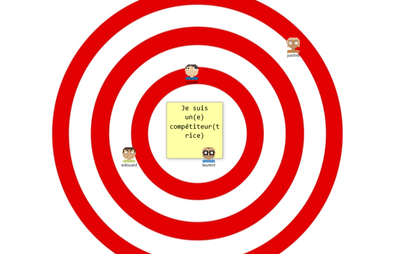

# LA CONSTELLATION

**Catégorie:** Briser la glace · **Phase:** Ouverture · **Difficulté:** Facile · **Durée:** 10' · **Participants:** 5-30

## Objectif

Mieux se comprendre, se connaitre et communiquer.

## Valeur ajoutée

Connaître rapidement le positionnement d'un groupe par rapport à un sujet.

## Résumé de la pratique

Les participants se positionnent autour de l'objet identifié en fonction des assertions proposées par le facilitateur.

## Materiel

- Une salle  suffisamment grande pour  se déplacer
- Un objet de référence à identifier et à partager avec les participants. (exemple une chaise)

## Variante

**Constellation d'opinions** : Posez des questions qui requièrent une prise de position (par exemple, tout à fait d'accord à pas du tout d'accord). Cela permet de visualiser la diversité des opinions.

**Constellation émotionnelle** : Utilisez des questions liées aux émotions pour explorer comment les participants se sentent par rapport à un projet, une idée, ou un événement.

**Constellation de compétences** : Demandez aux participants de se positionner selon leur niveau d'aise ou de compétence dans un domaine spécifique.

**Constellation de connaissance** : Utilisez cette variante pour évaluer le niveau de connaissance ou de compréhension d'un sujet.

## Source

[Lyssa Adkins](http://www.coachingagileteams.com/)

---

📄 [Télécharger la fiche pratique (PDF)](https://atelier-collaboratif.com/fiche-pratique-2-la-constellation.pdf)

🔗 [Voir sur L'Atelier Collaboratif](https://atelier-collaboratif.com/2-la-constellation.html)