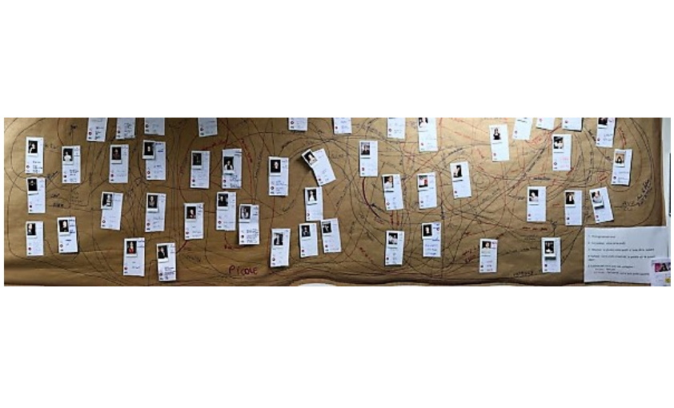

# LE RÉSEAU SOCIAL EN PAPIER

**Catégorie:** Briser la glace · **Phase:** Ouverture · **Difficulté:** Facile · **Durée:** 30' · **Participants:** 5-30

## Objectif

Apprendre à se connaître d'une manière ludique.

## Valeur ajoutée

Repérer en un clin d'œil le prénom d'un participant à qui l'on souhaite s'adresser. Idéal pour trouver des points communs afin d'initier la conversation ou former des groupes de travail par affinité.

## Résumé de la pratique

Utilisez cette technique pour que les participants apprennent à se connaître d'une manière ludique.

Chaque participant commence par rédiger une fiche profil en papier. Ensuite chacun vient à tour de rôle se présenter en allant coller sa fiche sur un brownpaper. Enfin, chacun vient matérialiser son réseau en traçant des traits vers les personnes qu'il connaît.

## Materiel

- Brown paper
- Feutres rouges et bleus
- Scotch
- Fiches bristol (pour chaque participant)

## Astuce

Cet ice breaker est idéal en fil rouge pour un séminaire d'une journée,

Tout au long de la journée, les participants peuvent établir des liens avec d'autres, offrant une opportunité pour les participants de créer et d'étendre leur réseau au sein du groupe.

---

📄 [Télécharger la fiche pratique (PDF)](https://atelier-collaboratif.com/fiche-pratique-3-le-reseau-social-en-papier.pdf)

🔗 [Voir sur L'Atelier Collaboratif](https://atelier-collaboratif.com/3-le-reseau-social-en-papier.html)