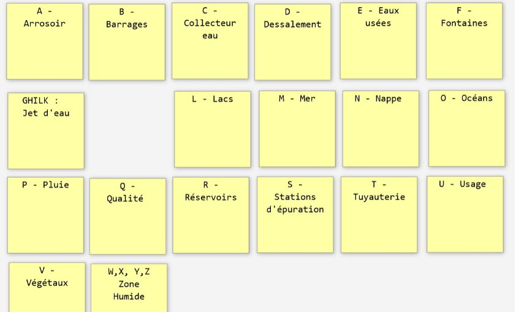

# L'ALPHABET DES IDÉES

**Catégorie:** Briser la glace · **Phase:** Ouverture · **Difficulté:** Facile · **Durée:** 30' · **Participants:** 5-20

## Objectif

Se préparer à un brainstorming.

## Valeur ajoutée

Révéler les talents créatifs de chacun et d'identifier les plus créatifs.

## Résumé de la pratique

Utiliser cette pratique pour briser la glace au début de votre atelier de créativité et pour connecter les participants au sujet proposé.

Demander aux participants d'imaginer à partir de lettres imposées, des mots en relation avec un sujet donné.

## Materiel

- Paperboard
- Feutres.

## Déroulé de l'atelier

### Préparation
Préparer pour chacun des participants des post-it. Sur chaque post-it est écrit une lettre de l'alphabet. Chaque participant reçoit donc un post-it avec une lettre de l'alphabet. Les lettres HIJK, WXYZ peuvent être regroupées sur un seul post-it.

### Éveil des Idées *(5')*
Les participants doivent écrire une idée en lien avec le sujet de l'atelier, commençant par la lettre sur leur post-it.

### Partage et émergence: *(25')*
Chaque participant présente ses mots.

Laissez les autres partiicpnats rebondir et proposer d'autres mots. Les premiers éléments de solution peuvent alors émerger de cette discussion.

Cette méthode est particulièrement utile quand les participants ne se connaissent pas et doivent partager des idées sur un sujet commun.

## Astuce

Dans le cadre d'une recherche de nom de produit, on peut utiliser cette technique pour générer un maximum de noms.

---

📄 [Télécharger la fiche pratique (PDF)](https://atelier-collaboratif.com/fiche-pratique-4-l-alphabet-des-idees.pdf)

🔗 [Voir sur L'Atelier Collaboratif](https://atelier-collaboratif.com/4-l-alphabet-des-idees.html)