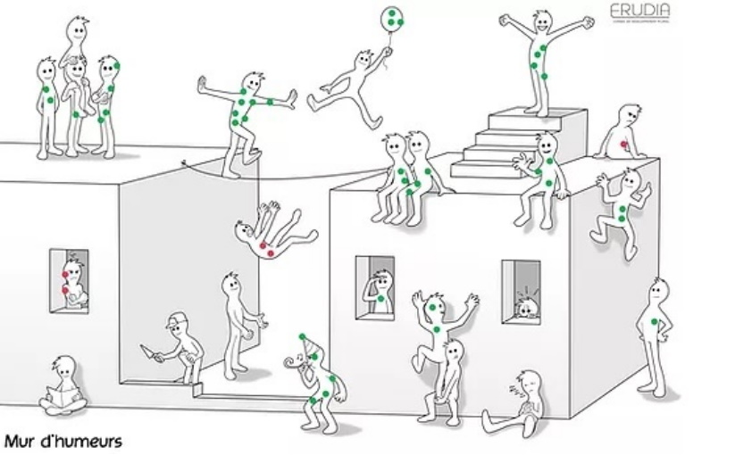

# L'ARBRE À PERSONNAGES

**Catégorie:** Briser la glace · **Phase:** Ouverture · **Difficulté:** Facile · **Durée:** 15' · **Participants:** 5-50

## Objectif

Faire exprimer un état d'esprit grâce au visuel.

## Valeur ajoutée

Moyen simple pour engager une discussion sur des sujets émotionnellement forts.

## Résumé de la pratique

Utiliser un arbre sur lequel sont dessinés des personnages et dont les positions permettent de faire des analogies avec un ressenti ou un état d'esprit.

## Materiel

- Arbre à personnages au format A3
- Gommettes.

## Déroulé de l'atelier

### Préparation & consigne
Remettre à chaque participant une gommette

Afficher l'arbre au format A3 sur lequel sont dessinés des personnages. Chaque position des personnages permet de faire des analogies avec un ressenti ou un état d'esprit.

### Expression des états d'esprit 2 1' à 2' par personne
Demander à chaque participant de coller sa gommette sur l'un des personnages qui représente le mieux son état d'esprit actuel Invitez ensuite chaque participant à expliquer pourquoi il a choisi ce personnage en particulier. Ce moment de partage favorise la compréhension mutuelle et l'ouverture au sein du groupe

## Point de vigilance

Créer un cadre sécurisant pour les participants en précisant qu'il  n'y a aucun jugement sur la position d'une personne sur l'arbre à personnage.    Chaque personnage dans l'arbre est soumis à interprétation de chacun des participants.

## Variante

Pour changer de l'arbre à personnages, vous pouvez utiliser un autre dessin : Le mur d'humeur

Ou encore mieux : Créez vous même votre propre affichette !

## Source

Travaillez en mode Workshop

## A télécharger

Arbre à personnages au format JPG Une autre version editée par Erudia

---

📄 [Télécharger la fiche pratique (PDF)](https://atelier-collaboratif.com/fiche-pratique-5-l-arbre-a-personnages.pdf)

🔗 [Voir sur L'Atelier Collaboratif](https://atelier-collaboratif.com/5-l-arbre-a-personnages.html)