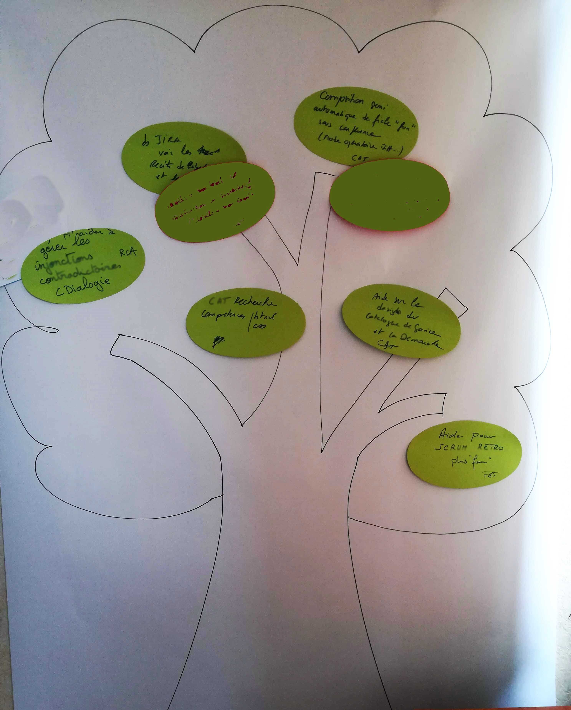

# CRACHE TA VALDA

**Catégorie:** Briser la glace · **Phase:** Ouverture · **Difficulté:** Expert · **Durée:** 90' · **Participants:** 5-15

## Objectif

Identifier et prioriser les sujets de préoccupation liés à un thème donné.

## Valeur ajoutée

Mettre à plat les éventuelles difficultés rencontrées par les membres de l'équipe en libérant et protégeant l'expression. Atelier propice à une communication sans tabou.

## Résumé de la pratique

Chaque participant note sur des Post-it (Valda) un élément qui le préoccupe/dérange dans le cadre du sujet abordé puis va les mettre sur l'arbre à Valda.

À tour de rôle, les participants décrochent de l'arbre une Valda dont ils ne sont pas auteur et la présentent au groupe en commençant la phrase par: " MOI, ce qui me préoccupe / dérange, c'est .. ".

Le reste du groupe peut réagir jusqu'à obtenir une parfaite compréhension de la problématique.

## Materiel

- 2/3 post-it verts par participant.

## Déroulé de l'atelier

### Préparation
Distribuer 2 à 3 post it par participant et dessiner un arbre représentant l'arbre à Valda.

### Expression des préoccupations *(15')*
Les participants individuellement inscrivent sur les Valda (post-it vert) les éléments qui dérangent dans le projet et les accrochent à l'arbre.

### Partage et compréhension collective 60' en fonction du nombre de participants
À tour de rôle, les participants (non-auteurs des Valda) décrochent une Valda de l'arbre et la présentent au groupe, en encourageant la discussion et la compréhension mutuelle.

### Priorisation collective *(15')*
Les participants à l'aide du  facilitateur priorisent les Valda qui ont été choisies via la méthode de la gommettocratie par exemple.

## Source

Travaillez en mode Workshop

---

📄 [Télécharger la fiche pratique (PDF)](https://atelier-collaboratif.com/fiche-pratique-7-crache-ta-valda.pdf)

🔗 [Voir sur L'Atelier Collaboratif](https://atelier-collaboratif.com/7-crache-ta-valda.html)