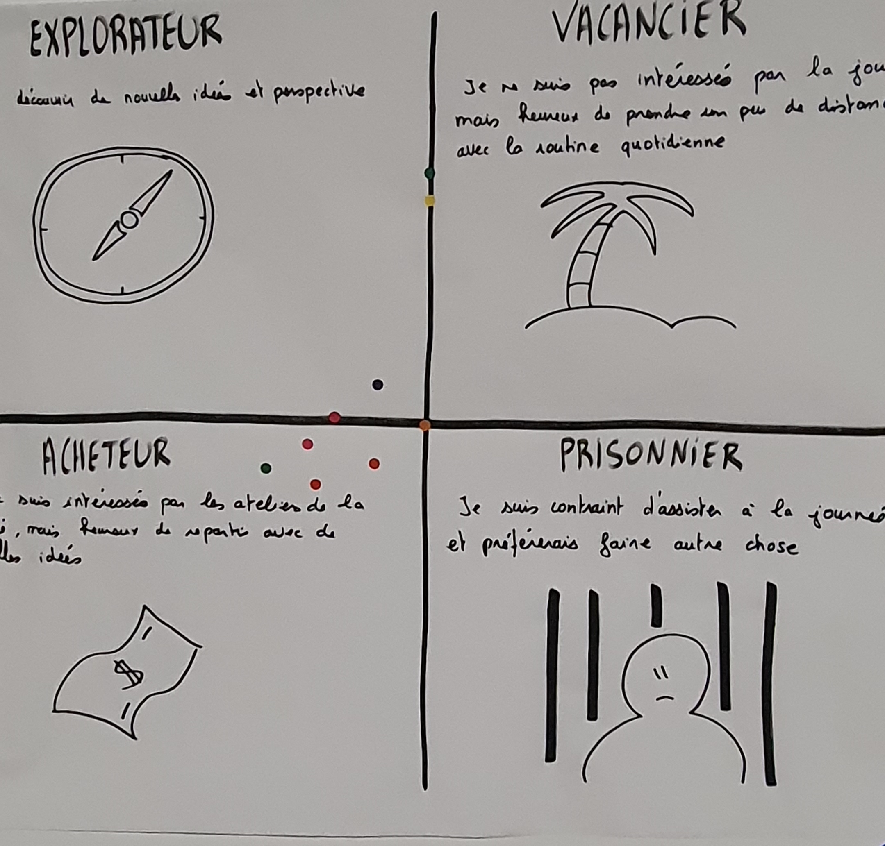

# PRISONNIER, ACHETEUR, VACANCIER,  EXPLORATEUR

**Catégorie:** Briser la glace · **Phase:** Ouverture · **Difficulté:** Facile · **Durée:** 5' · **Participants:** 10-50

## Objectif

Mesurer l'engagement des participants lors d'un atelier qui démarre.

## Valeur ajoutée

Outil simple et rapide permettant de jauger rapidement son public

## Résumé de la pratique

Demander à chaque participant d'indiquer anonymement son attitude vis-à-vis de l'atelier qui démarre en tant que Explorateur, Acheteur, Vacancier ou Prisonnier.

## Materiel

- Paperboards
- Feutres
- Post-it.

## Déroulé de l'atelier

### Etape 1 *(5')*
Le facilitateur invite chaque participant à indiquer anonymement , à l'aide d'une gommette, son attitude vis-à-vis de l'atelier qui démarre. Les options sont : Explorateur , Acheteur , Vacancier , ou Prisonnier .

les Explorateurs sont désireux de découvrir de nouvelles idées et perspectives. Ils veulent apprendre tout ce qu'ils peuvent sur le projet.

les Acheteurs se penchent sur toutes les informations disponibles et seront heureux de rentrer à la maison avec un nouvelle idée utile.

les Vacanciers ne sont pas intéressés par l'atelier mais sont heureux de prendre un peu de distance avec la routine quotidienne.

les Prisonniers ont l'impression qu'ils ont été contraints d'assister à l'atelier et préféreraient faire autre chose.

### Analyse  2 5' optionnel
Recueillir les résultats et faire un histogramme pour afficher les données. Prendre en compte les résultats afin de faciliter la discussion sur ce que signifie ces résultats pour le groupe. Vous pouvez proposer une réévaluation à mi-parcours ou à la fin de l'atelier et demander aux participants de voir si leur perception a changé et discuter des facteurs qui ont contribué à cette évolution.

## Source

Paulo Caroli et Taina Caetano

---

📄 [Télécharger la fiche pratique (PDF)](https://atelier-collaboratif.com/fiche-pratique-8-prisonnier-acheteur-vacancier--explorateur.pdf)

🔗 [Voir sur L'Atelier Collaboratif](https://atelier-collaboratif.com/8-prisonnier-acheteur-vacancier--explorateur.html)