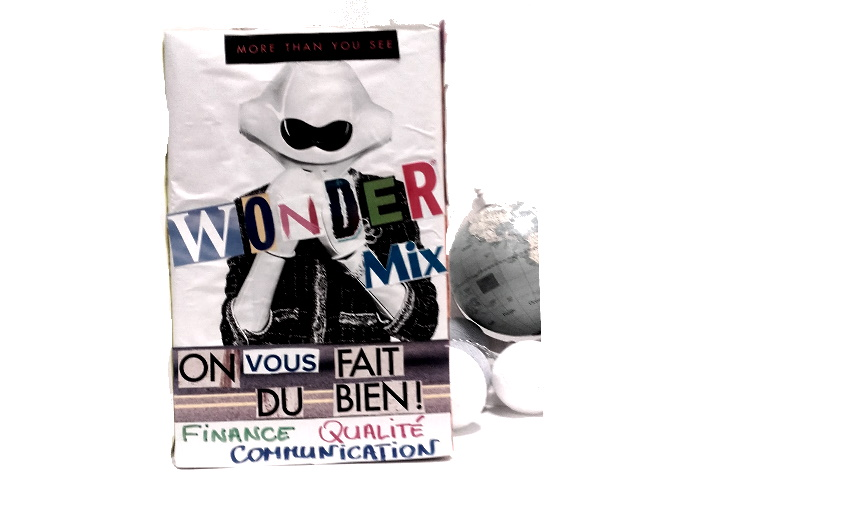

# LA BOÎTE À PRODUIT

**Catégorie:** Partager la vision · **Phase:** Ouverture Exploration Fermeture · **Difficulté:** Intermédiaire · **Durée:** 120' · **Participants:** 5-30

## Objectif

Obtenir la vision d'un produit et la partager avec l'équipe chargée de le concevoir.

## Valeur ajoutée

Constitue un outil de focalisation efficace. Elle permet de rassembler une multitude d'informations abstraites en un objet concret et tangible. Cet objet peut ensuite être exposé, par exemple dans un open space, facilitant ainsi les discussions. Il s'avère particulièrement utile lors des échanges autour de la vision de l'entreprise, des services ou d'un produit

## Résumé de la pratique

Faire réaliser à un groupe une image visuelle et concrète d'un produit ou d'un service qu'il est censée développer.

Utiliser une boîte en carton matérialisant le produit , l'équipe aura alors pour objectif de remplir chaque face de cette boîte par des images, du texte ou tout autre visuel.

L'atelier se déroule sur 3 phases : l'introduction, la création de boîtes et la mise en commun du travail avec simulation de vente.

## Materiel

- Boites en carton vierges et blanches
- Scotch
- Post-it
- Ciseaux
- Feutres

## Déroulé de l'atelier

### Décrire le contenu de la boîte *(30')*
Inviter les participants à réfléchir ce qu'elle pourrait contenir. Vous pouvez alors commencer par un brainstorming (exemple diagramme d'affinité ). Cette étape d'introduction permet de fournir " juste assez " d'informations aux participants pour qu'ils se sentent à l'aise et prêts à commencer l'exercice.

### Créer la boîte *(45')*
Indiquer aux participants le temps dont ils disposent (30 minutes maximum) pour créer la boîte de leur choix. Inviter-les à imaginer qu'ils découvrent cette boîte par hasard dans un rayon, emballée et prête à être vendue. Sa conception peut être facilitée par quelques questions du type : Quel est son nom ?, son but ? son slogan ? ses avantages ? Quels éléments visuels pourraient la mettre en valeur ? Sur chaque face de de la boîte, on peut retrouver : un slogan, les fonctionnalités, les freins, les leviers etc... Le facilitateur explique aux participants qu'ils sont absolument libres dans la création de leur boîte.

### Vendre la boîte *(30')*
Chaque équipe doit avoir la possibilité de "vendre" sa boîte au groupe par un pitch de 2 à 3 minutes maximum.

### Voter pour une boîte *(15')*
A la fin de l'atelier, le groupe s'accorde sur une boîte unique acceptée par tous en utilisant le vote ( par exemple par la technique de la gommettocratie ).

## Source

Luke Hohmann (Innovation Games)

---

📄 [Télécharger la fiche pratique (PDF)](https://atelier-collaboratif.com/fiche-pratique-10-la-boite-a-produit.pdf)

🔗 [Voir sur L'Atelier Collaboratif](https://atelier-collaboratif.com/10-la-boite-a-produit.html)