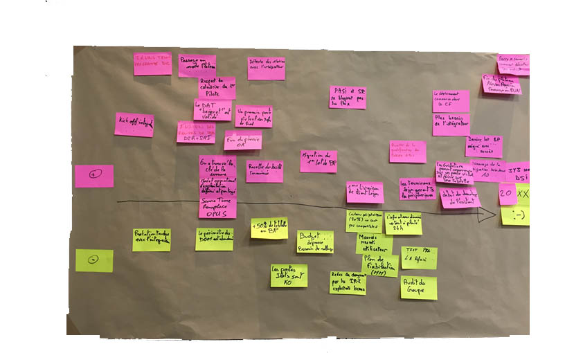

# RETOUR VERS LE FUTUR

**Catégorie:** Partager la vision · **Phase:** Ouverture Exploration · **Difficulté:** Intermédiaire · **Durée:** 60-90' · **Participants:** 5-30

## Objectif

Partager une vision commune et identifier le chemin à parcourir afin d'atteindre l'objectif.

## Valeur ajoutée

Changer la façon de concevoir un planning. Partir plutôt de la fin afin d'identifier les étapes à prévoir pour atteindre l'objectif.

## Résumé de la pratique

L'idée principale est de réaliser une feuille de route en partant de la date de fin et en mettant les participants dans un contexte qui peut être par exemple : "Nous sommes en janvier 2022. Le projet est un succès total. Rappelez-vous tout ce que nous avons fait pour en arriver là...".

## Materiel

- Brown Paper
- Post-it
- Feutres.

## Déroulé de l'atelier

### Constituer les groupes *(10')*
Idéalement, limitez le nombre de participants à 5 pour une interaction optimale. Toutefois, pour des groupes plus importants, divisez-les en sous-groupes avec un animateur dédié pour chaque groupe. Cette approche assure une meilleure gestion et une participation active de tous les membres.

### Identifier l'objectif 15'-30'
Commencez par clarifier et noter l'objectif principal sur un brown paper. Formulez-le de manière concise et précise, comme s'il avait déjà été atteint dans le futur. Etape cruciale pour orienter l'atelier vers un but commun.

### Imaginer le parcours *(30')*
Tracez une ligne temporelle, débutant à l'instant présent et s'étendant jusqu'à la date visée pour l'atteinte de l'objectif. Les participants élaborent ensuite le chemin pour parvenir à la cible. A l'aide des post-it de différentes couleurs, les participants pourront marquer les éléments clés tels que les forces, les faiblesses, les imprévus, les événements internes et externes, les jalons, les étapes importantes, l'organisation et les aspects techniques. Cette méthode colorée facilite l'

identification et la distinction des différents facteurs influençant le parcours.

### Restituer 5' par groupe
A la fin de l'atelier, invitez un membre de chaque groupe à présenter le parcours élaboré. Cette étape de restitution permet de partager les visions, comprendre les différentes perspectives et renforcer la cohésion d'équipe autour de l'objectif commun.

## Astuce

Pour définir efficacement un objectif dans un atelier "Remember the Future", assurez-vous qu'il soit spécifique, mesurable, atteignable, pertinent, et temporellement défini; Impliquer l'équipe dans la formulation de l'objectif, ce qui peut constituer un atelier préparatoire distinct, précédant celui-ci.

## Source

Luke Hohmann (Innovation Games)

---

📄 [Télécharger la fiche pratique (PDF)](https://atelier-collaboratif.com/fiche-pratique-11-retour-vers-le-futur.pdf)

🔗 [Voir sur L'Atelier Collaboratif](https://atelier-collaboratif.com/11-retour-vers-le-futur.html)