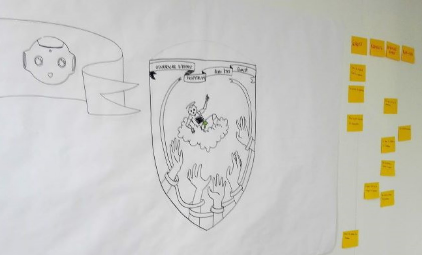

# LE BLASON

**Catégorie:** Partager la vision · **Phase:** Ouverture Exploration Fermeture · **Difficulté:** Intermédiaire · **Durée:** 120' · **Participants:** 5-50

## Objectif

Partager collectivement la vision d'une entité, d'une équipe

## Valeur ajoutée

Rendre concret l'identité d'une équipe en utilisant la métaphore des armoiries.
	Permet de donner un sens et une raison d'être à une équipe surtout lorsqu"elle se forme.

## Résumé de la pratique

Laisser s'exprimer le collectif sur ce qui constitue leur équipe : sa mission, ses valeurs, ses objectifs et un slogan qui la définirait au mieux.

Ces 4 dimensions seront ensuite représentées sous la forme d'un blason à l'aide d'image, dessin ou tout autre moyen visuel.

## Materiel

- Un blason au format A3
- Feutres
- Magazines (optionnel)
- Ciseaux (optionnel)
- Colle(optionnel)

## Déroulé de l'atelier

### Présentation de l'atelier *(5')*
Présenter l'atelier et la notion de blason puis former des sous-groupes (entre 5 et 8 personnes).

### Brainstorming *(30')*
En mode brainstorming , commencez par définir la mission de l'équipe, suivi par ses valeurs, ses objectifs opérationnels, et enfin le slogan.

Vous pouvez aidez  l'équipe en posant des questions du type:

- Mission de l'équipe :Pourquoi sommes-nous là ?Pourquoi certaines actions sont-elles prioritaires ?

- Valeurs :Quels sont nos principes fondamentaux ?Comment les appliquons-nous ?

- Objectifs réalisables et mesurables:Quels sont nos buts ?Que faisons-nous ?

- Slogan:Quelle phrase résume notre équipe ?

### Filtrage , priorisation , vote *(45')*
Faire voter et prioriser les mots qui parlent le plus aux participants en utiilisant la gommettocratie par exemple.

Mettre en commun les elements du blason  et faire valider collectivement les 4 cadrans du blason.

### Construction du blason *(30')*
Faire réaliser des dessins et textes du blason collectif final. Vous pouvez utiliser du carton plume, ce qui permet de rendre le blason plus durable.

## Variante

Il  est également possible de demander aux participants dans un deuxième temps, de brainstormer sur les 12 commandements ou les 12 principes qui régissent l'équipe.

## Source

Passer en mode workshop

## A télécharger

Modèles de blason au format Powerpoint Modèle de blason au format SVG (merci à Marc Dugué) Exemple de présentation d'atelier

---

📄 [Télécharger la fiche pratique (PDF)](https://atelier-collaboratif.com/fiche-pratique-13-le-blason.pdf)

🔗 [Voir sur L'Atelier Collaboratif](https://atelier-collaboratif.com/13-le-blason.html)