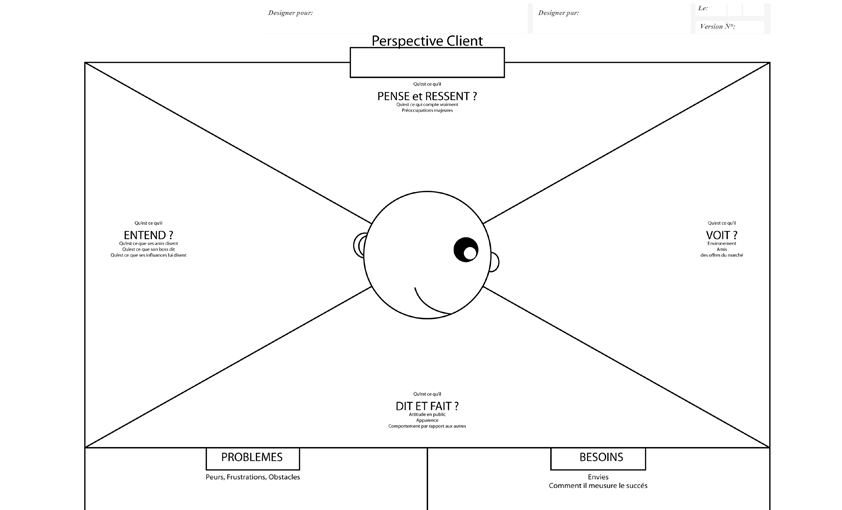

# EMPATHY MAP

**Catégorie:** Partager la vision · **Phase:** Ouverture Exploration · **Difficulté:** Facile · **Durée:** 15' · **Participants:** 5-15

## Objectif

Cerner le profil d'un client ou d'un utilisateur type.

## Valeur ajoutée

Permet d'attirer l'attention du groupe sur un élément essentiel : les individus.

## Résumé de la pratique

Etudier en groupe les caractéristiques d'un profil d'utilisateur en dessinant la tête d'une personne puis demander aux participant de se mettre dans la peau du personnage et de décrire ce qu'il " Pense ", " Voit ", " Dit ", " Fait ", " Ressent " et " Entend ".

## Materiel

- Paperboard
- post-it
- feutres.

## Déroulé de l'atelier

### Préparation *(5')*
Tracer sur un paperboard un cercle assez grand pour pouvoir écrire à l'intérieur puis dessiner des yeux et des oreilles pour qu'il ressemble à une large " tête ".

Inscrire ensuite les verbes autour de la tête dessinée : " Pense ", " Voit ", " Dit ", " Fait ", " Ressent " et " Entend ".

Donner un nom au personnage.

### Exploration *(10')*
Demander aux participants de se mettre dans la peau du personnage et de décrire son expérience pour chaque catégorie (" Voit ", " Ressent ", etc.).

## Astuce

Le but de cette méthode est de produire un certain degré d'empathie à l'égard du personnage créé.

Demander aux membres du groupe d'être synthétiques : Quels sont les désirs de ce personnage ? Ses motivations ? Que peut-on faire pour satisfaire ses besoins ?

## Source

Scott Matthews

## A télécharger

Empathy Map au format PDF

---

📄 [Télécharger la fiche pratique (PDF)](https://atelier-collaboratif.com/fiche-pratique-14-empathy-map.pdf)

🔗 [Voir sur L'Atelier Collaboratif](https://atelier-collaboratif.com/14-empathy-map.html)