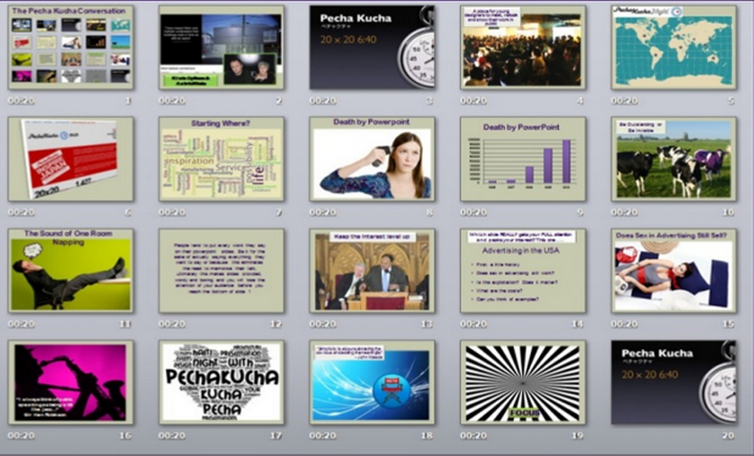

# LE PECHA KUCHA

**Catégorie:** Partager la vision · **Phase:** Ouverture · **Difficulté:** Expert · **Durée:** 6'40 · **Participants:** >5

## Objectif

Réaliser une présentation dynamique en utilisant uniquement des images .

## Valeur ajoutée

Favoriser l'esprit de synthèse.
	Eviter de monopoliser du temps.
	Développer la capacité à présenter et à communiquer une idée

## Résumé de la pratique

Faire une présentation en utilisant uniquement des images et en limitant le temps passé sur chaque image. Vous capterez l'attention de votre auditoire et votre discours en sera d'autant plus percutant. La projection de 20 diapositives se succède toutes les 20 secondes (la présentation dure au total 6'40 au total).

## Astuce

Aider vous de la recherche d'images sur Google Images.  Pour un rendu plus professionnel, il existe des banques d'images comme :

Adobe Stock iStock Dreamstime 123RF Ecpictura Shutterstock Burst

Timeboxer la présentation sur PowerPoint.

Entrainer-vous à présenter les diapositives.

## Source

Astrid Klein et Mark Dytham

## A télécharger

http://www.pechakucha.org/

---

📄 [Télécharger la fiche pratique (PDF)](https://atelier-collaboratif.com/fiche-pratique-15-le-pecha-kucha.pdf)

🔗 [Voir sur L'Atelier Collaboratif](https://atelier-collaboratif.com/15-le-pecha-kucha.html)