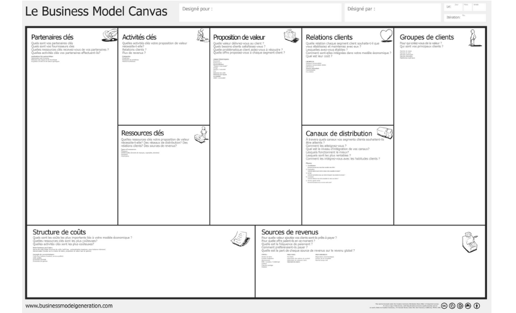

# BUSINESS MODEL CANVAS

**Catégorie:** Partager la vision · **Phase:** Ouverture Exploration Fermeture · **Difficulté:** Intermédiaire · **Durée:** 120' · **Participants:** 5-10

## Objectif

Expliciter le business model d'un service, d'une société

## Valeur ajoutée

Aider une organidation à analyser, formaliser et vérifier le potentiel son modèle économique

## Résumé de la pratique

Le Business Model Canvas est une matrice visuelle composée de 9 blocs.

- Segments de clientèle

- La proposition de valeur

- Les activités clés

- Les partenaires clés

- Les relations avec les clients

- Les canaux

- Les ressources clés

- La structure des coûts

- Les flux de revenus

## Materiel

- Brownpaper
- Post-it
- Feutres.

## Déroulé de l'atelier

### Détermination du profil *(60')*
Focaliser la première partie de l'atelier sur le profil de l'utilisateur (ou du client).

Demander aux participants de réfléchir soit individuellement soit en groupe sur les étapes 1 à 3 du modèle à savoir :

### Proposition de valeur *(60')*
Demander dans un premier temps de déterminer les fonctionnalités à offrir aux utilisateurs qui puissent répondre à leurs attentes (4- FONCTIONALITES).

Demander comment ces fonctionnalités atténuent ou éliminent les ennuis (5 - ANALGESIQUES).

Demander comment ces fonctionnalités créées pour les utilisateurs (6- BENEFICES).

## Source

[https://strategyzer.com/](https://strategyzer.com/)

## A télécharger

Business Model Canvas en Français et au format PDF

---

📄 [Télécharger la fiche pratique (PDF)](https://atelier-collaboratif.com/fiche-pratique-17-business-model-canvas.pdf)

🔗 [Voir sur L'Atelier Collaboratif](https://atelier-collaboratif.com/17-business-model-canvas.html)