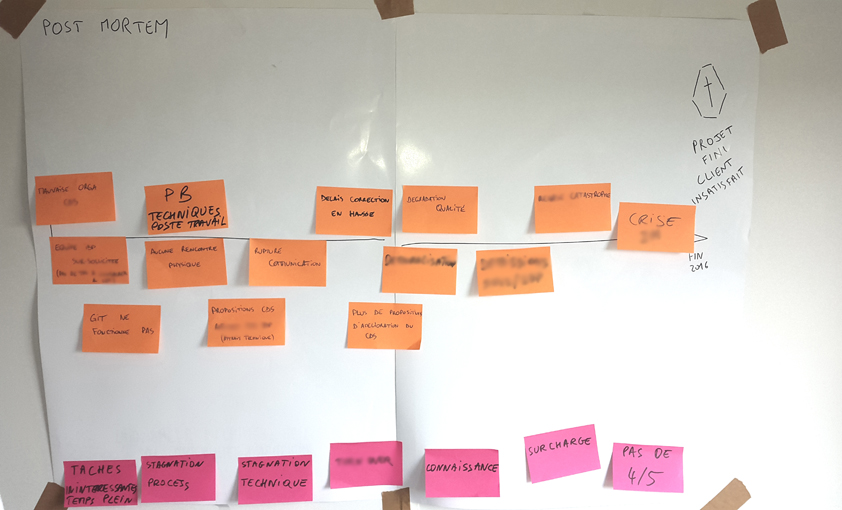

# SESSION "PRE MORTEM"

**Catégorie:** Partager la vision · **Phase:** Ouverture Exploration · **Difficulté:** Expert · **Durée:** 60-90' · **Participants:** 5-30

## Objectif

Effectuer une analyse dès le lancement d'un projet afin d'en affronter les risques.

## Valeur ajoutée

Contrairement à un atelier classique sur les risques du projet, une session pré-mortem contraint les participants à puiser au plus profond de leur expérience et de leur intuition au stade le plus critique du projet.

## Résumé de la pratique

Le pre-mortem permet d'anticiper les raisons potentielles de l'échec d'un projet. Contrairement à un post-mortem, qui analyse les raisons d'un échec après qu'il se soit produit, le pre-mortem invite les participants à envisager un avenir où le projet a échoué et à identifier les facteurs qui pourraient conduire à cet échec, en se libérant du biais cognitif habituel d'optimisme.

## Materiel

- Paperboard
- Post-it
- Feutres.

## Source

Gary Klein

---

📄 [Télécharger la fiche pratique (PDF)](https://atelier-collaboratif.com/fiche-pratique-18-session-pre-mortem.pdf)

🔗 [Voir sur L'Atelier Collaboratif](https://atelier-collaboratif.com/18-session-pre-mortem.html)