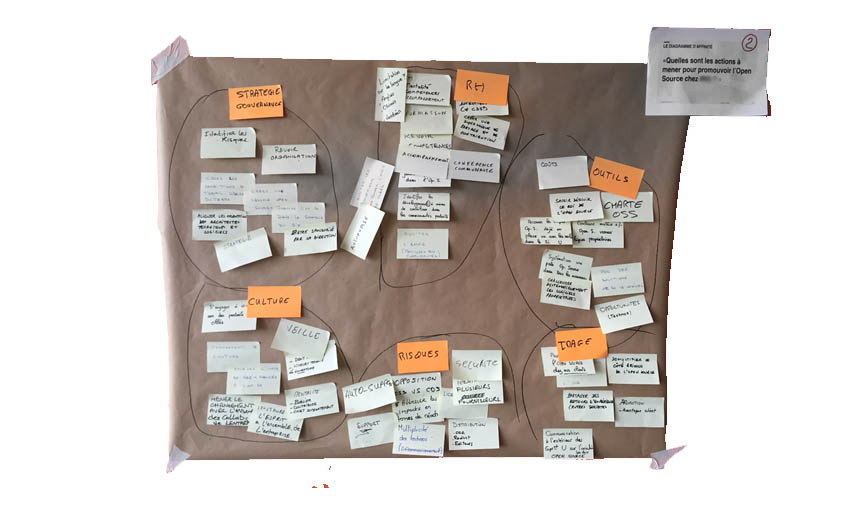

# LE BRAINSTORMING

**Catégorie:** Générer des idées · **Phase:** Ouverture Exploration · **Difficulté:** Intermédiaire · **Durée:** 60-90' · **Participants:** 5-30

## Objectif

Récolter un maximum d'idées originales.

## Valeur ajoutée

Facilite l'émergence des nouvelles idées. Implique les participants dans une logique d'amélioration de la cohésion de l'équipe.

## Résumé de la pratique

Appelé également tempête d'idées ou remue-méninges, cette méthode permet de recueillir un maximum d'idées. Il est principalement utilisé dans les phases de créativité en favorisant le travail d'équipe et en exploitant le meilleur des idées de chacun.

## Materiel

- Paperboard
- Post-it
- Feutres.

## Déroulé de l'atelier

### Réflexion individuelle *(5')*
Durant cette phase, les participants sont invités à noter leurs idées en lien avec le thème abordé sur des post-it, en veillant à écrire une idée par post-it.

Cette étape se déroule en silence et dure généralement 5 minutes. Cela permet à chacun de se concentrer pleinement sur ses propres réflexions sans être influencé par les autres.

### Partage et dynamique des idées *(30-60')*
Par la suite, chaque participant, à tour de rôle, colle ses post-it sur un tableau et présente brièvement ses idées. Le rôle du facilitateur est crucial ici : il veille à ce que chaque personne participe et encourage les autres à rebondir sur les idées exposées. Cette interaction favorise une dynamique de groupe stimulante et créative.

### Classification et purge *(30')*
Une fois toutes les idées exposées, le facilitateur aide le groupe à les organiser.

Ensemble, ils classent les idées par thèmes apparents, en s'appuyant éventuellement sur le diagramme d'affinité . Cette étape permet de clarifier et de regrouper les idées, facilitant ainsi leur analyse.

## Astuce

Encourager les participants à écrire de manière concise et lisible. Des idées clairement formulées sont plus facilement partageables et compréhensibles par tous. Prenez des feutres noirs de préférence

Utiliser un minuteur pour signaler la fin du temps imparti à chaque participant. Cela aide à maintenir le rythme sans paraître trop autoritaire.

## Source

Alex Osborn

---

📄 [Télécharger la fiche pratique (PDF)](https://atelier-collaboratif.com/fiche-pratique-19-le-brainstorming.pdf)

🔗 [Voir sur L'Atelier Collaboratif](https://atelier-collaboratif.com/19-le-brainstorming.html)