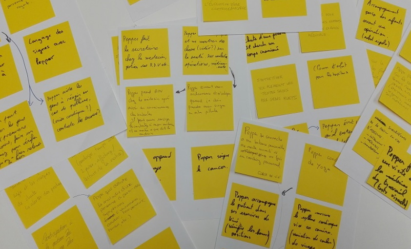

# BRAINWRITING

**Catégorie:** Générer des idées · **Phase:** Ouverture Exploration · **Difficulté:** Facile · **Durée:** 30' · **Participants:** 5-30

## Objectif

Générer un maximum idées.

## Valeur ajoutée

Variante du brainstorming à utiliser dans de multiples contextes où l'on cherche à générer des idées (atelier de résolution de problèmes, recherche de solutions, ...).

## Résumé de la pratique

Demandez à chaque participant d'écrire chacune de ses idées sur une feuille A4 et de les passer à son voisin afin qu'il les enrichisse. Cette pratique permet à chaque participant de s'exprimer et de rebondir par écrit sur les idées émises par les autres participants.

## Materiel

- Feuille A4
- Post-it
- Feutres.

## Déroulé de l'atelier

### Consignes *(5')*
Expliquer la problématique et s'assurer qu'elle est comprise par tout le monde.

### Génération d'idées 25' pour un groupe de 5 personnes
Demander à chaque participant d'inscrire 3 idées sur 3 post-it et de les coller sur une feuille A4.

Donner 5 minutes aux participants pour y inscrire ses 3 idées.

Au bout de 5 minutes, faire tourner la feuille à son voisin qui peut s'inspirer / réagir aux suggestions déjà remplies.

Refaire l'opération jusqu'à ce que la feuille tourne auprès de chaque participant

Au bout de 25', un groupe de 5 personnes aura généré en théorie 5x3x5 = 75 idées !

## Astuce

Vous allez vous retrouver avec énormement d'idées et parfois similaires.  Faîtes alors faire un [diagramme d'affinité](22-diagramme d'affinité.html) afin d'organiser les idées.

---

📄 [Télécharger la fiche pratique (PDF)](https://atelier-collaboratif.com/fiche-pratique-21-brainwriting.pdf)

🔗 [Voir sur L'Atelier Collaboratif](https://atelier-collaboratif.com/21-brainwriting.html)