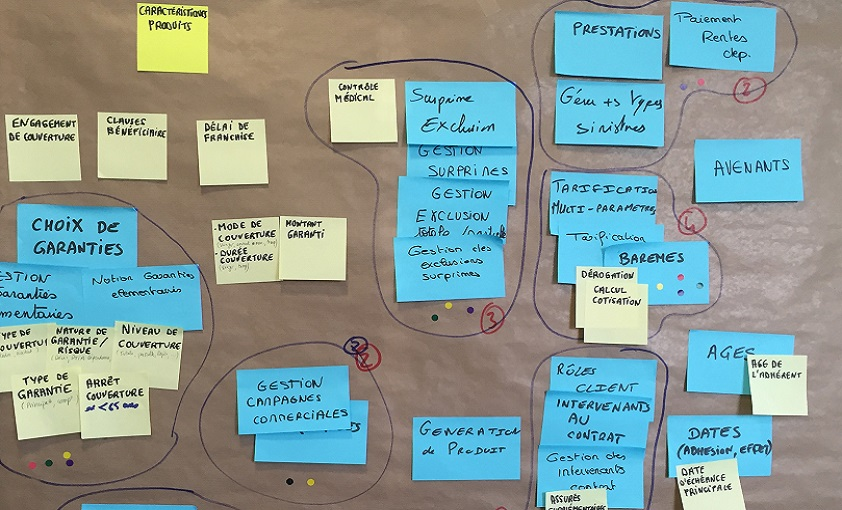

# LE DIAGRAMME D'AFFINITÉ

**Catégorie:** Générer des idées · **Phase:** Fermeture · **Difficulté:** Intermédiaire · **Durée:** 60' · **Participants:** 5-15

## Objectif

Organiser les idées.

## Valeur ajoutée

Facilite l'émergence des nouvelles idées. Outil simple pour clarifier un problème.

## Résumé de la pratique

Le diagramme d'affinité est un outil généralement employé pour organiser des idées évoquées lors d'un brainstorming (ou autre méthode de recherche d'idées) en les structurant par thèmes ou catégories. Ces thèmes seront établis en fonction des liens existants entre les différentes idées = affinité des idées les unes avec les autres.

## Materiel

- Paperboard
- post-it
- feutres.

## Déroulé de l'atelier

### Idéation
Utiliser la technique du brainstorming ou du brainwriting pour générer un maximum d'idées.

### Catégoriser
L'animateur prend un à un chaque post-it puis commence à grouper des points communs entre les idées et les regrouper en catégories. Les catégories seront notées sur un post-it de couleur différentes. Les noms des catégories devront être validés par le groupe.

## Source

Appelé également Diagramme KJ identifiée par les initiales de son auteur : Jiro Kawakita

---

📄 [Télécharger la fiche pratique (PDF)](https://atelier-collaboratif.com/fiche-pratique-22-le-diagramme-d-affinite.pdf)

🔗 [Voir sur L'Atelier Collaboratif](https://atelier-collaboratif.com/22-le-diagramme-d-affinite.html)