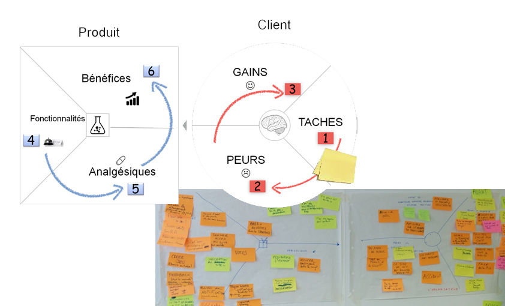

# VALUE PROPOSITION CANVAS

**Catégorie:** Générer des idées · **Phase:** Ouverture Exploration · **Difficulté:** Expert · **Durée:** 60-120' · **Participants:** 5-20

## Objectif

Structurer l'élaboration d'une proposition de valeur en s'attachant au profil du client ou de l'utilisateur

## Valeur ajoutée

Modèle simplifié permettant de trouver de nouvelles fonctionnalités en partant du profil de l'utilisateur.

## Résumé de la pratique

Le canevas de proposition de valeur (Value Proposition Canvas) permet : 1- De comprendre le profil du client sur la base de son environnement, ses préoccupations, ses aspirations 2- De proposer une proposition de valeur sur la base des attentes du client.

## Materiel

- Paperboard
- Post-it
- Feutres.

## Déroulé de l'atelier

### Détermination du profil *(10')*
Focaliser la première partie de l'atelier sur le profil de l'utilisateur (ou du client) .

Demander aux participants de réfléchir soit individuellement soit en groupe sur les étapes 1 à 3 du modèle à savoir :

1- TACHES : les tâches que réalisent l'utilisateur,

2- PEURS : les émotions négatives, les obstacles, les imprévus, les éléments perturbateurs des utilisateurs,

3- GAINS : ce qu'attendent ou ce qui pour pourraient surprendre les utilisateurs.

### Proposition de valeur *(45')*
Demander dans un premier temps de déterminer les fonctionnalités à offrir aux utilisateurs qui puissent répondre à leurs attentes (4- FONCTIONNALITES ).

Demander comment ces fonctionnalités atténuent ou éliminent les ennuis (5 - ANALGESIQUES ).

Demander comment ces fonctionnalités créées pour les utilisateurs ( 6- BENEFICES ).

## Source

[https://strategyzer.com/](https://strategyzer.com/)

## A télécharger

Value Proposition Canvas en français

---

📄 [Télécharger la fiche pratique (PDF)](https://atelier-collaboratif.com/fiche-pratique-23-value-proposition-canvas.pdf)

🔗 [Voir sur L'Atelier Collaboratif](https://atelier-collaboratif.com/23-value-proposition-canvas.html)