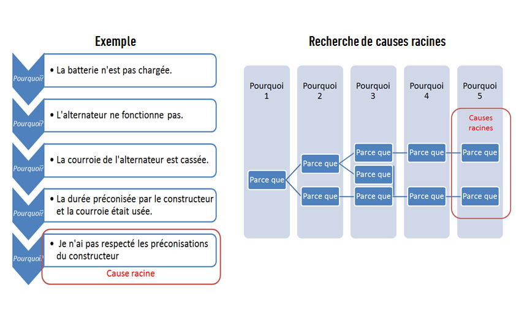

# LES "5 POURQUOI"

**Catégorie:** Résoudre des problèmes · **Phase:** Exploration · **Difficulté:** Facile · **Durée:** 30-60' · **Participants:** 5-15

## Objectif

Remonter à la cause racine d'un problème.

## Valeur ajoutée

Evite de se contenter des premiers problèmes soulevés. La plupart du temps ce ne sont que des symptômes.
	En remontant aux causes racines, la solution sera, à la fois, plus facile à corriger et plus efficace dans le temps.

## Résumé de la pratique

Les " 5 Pourquoi " est un outil de résolution de problème permettant de remonter à la cause racine d'un problème en se posant plusieurs fois la question " Pourquoi " .

## Materiel

- Brown Paper
- Post-it
- Feutres.

## Déroulé de l'atelier

### Décrire le problème *(5')*
Décrire et identifier clairement le problème en se posant la question " Que se passe-t-il ? ".

### Pourquoi x 5 *(25')*
Énoncer le problème en répondant à la première question commençant par Pourquoi (exemple pourquoi ce problème est-il apparu ?).

La réponse à ce premier " Pourquoi " est une cause symptomatique. Elle devient le nouveau problème à résoudre. Reformuler une nouvelle question commençant par " Pourquoi ", afin de trouver le pourquoi du pourquoi. A travers chacune des réponses obtenues, remonter graduellement les causes symptomatiques pour mettre en évidence les causes fondamentales du phénomène observé.

En général, avant le 5ème " Pourquoi ", les causes racines du problème apparaissent .

## Source

5 Why (Lean)

---

📄 [Télécharger la fiche pratique (PDF)](https://atelier-collaboratif.com/fiche-pratique-25-les-5-pourquoi.pdf)

🔗 [Voir sur L'Atelier Collaboratif](https://atelier-collaboratif.com/25-les-5-pourquoi.html)