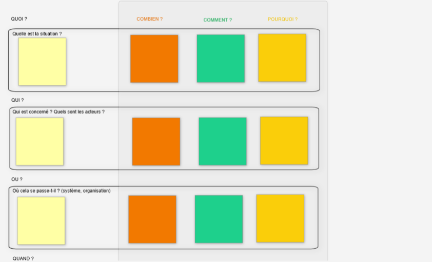

# QQOQCP

**Catégorie:** Résoudre des problèmes · **Phase:** Exploration · **Difficulté:** Intermédiaire · **Durée:** 60' · **Participants:** 5-15

## Objectif

Rassembler des informations concernant une problématique.

## Valeur ajoutée

Permet de collecter rigoureusement les informations nécessaires pour répondre à une problématique en suivant une logique de questionnement.

## Résumé de la pratique

Présenter la grille QQOQCP puis les participants doivent la remplir soit individuellement soit par groupe. Ensuite, le groupe élabore une synthèse de la problématique.

## Materiel

- Paperboard
- post-it
- feutres.

## Déroulé de l'atelier

### Présentation de la grille
Le facilitateur présente le sujet et la grille QQOQCP.

### Réflexion par groupe ou individuel
Les participants remplissent la grille par groupe en répondant à toutes les questions. Si besoin, la question "Pourquoi" pourra être déterminée avec l'outil des " 5 Pourquoi " ou du " Diagramme d'Ishikawa ".

### Synthèse
Les participants mettent en commun les grilles. La recherche de solution pourra alors être effectuée lors d'un autre QQOQCP .

## Source

Lean

---

📄 [Télécharger la fiche pratique (PDF)](https://atelier-collaboratif.com/fiche-pratique-26-qqoqcp.pdf)

🔗 [Voir sur L'Atelier Collaboratif](https://atelier-collaboratif.com/26-qqoqcp.html)