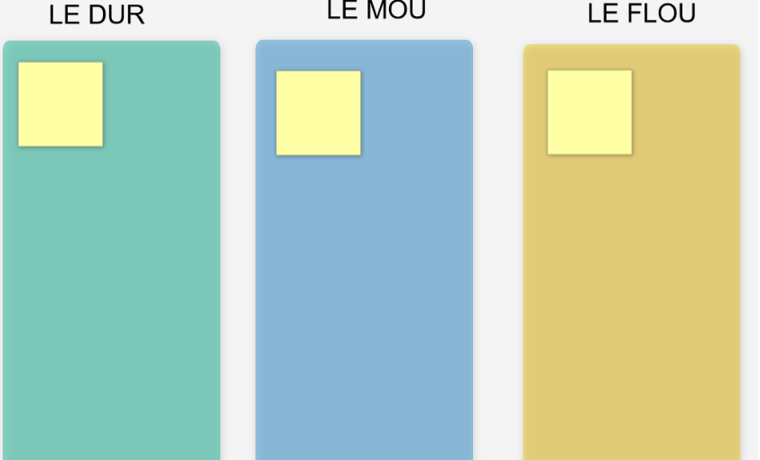

# LE DUR, LE MOU, LE FLOU

**Catégorie:** Résoudre des problèmes · **Phase:** Exploration Fermeture · **Difficulté:** Facile · **Durée:** 60' · **Participants:** 5-15

## Objectif

Définir le périmètre de travail d'une équipe.

## Valeur ajoutée

Permet à chacun de connaitre sa marge de manœuvre dans un projet et de mieux connaitre son rôle et mieux définir ses actions.
	Les différentes perceptions se croisent pour mieux faire converger le collectif, le fonctionnement de l'équipe s'en trouve amélioré.

## Résumé de la pratique

Les participants devront définir ce qui dans le projet ou l'organisation représente : le DUR, le MOU, le FLOU. Les participants construisent ensuite une synthèse collectivement.

## Materiel

- Paperboard
- Post-it
- Feutres

## Déroulé de l'atelier

### Explication *(5')*
Poser la problématique sur un brown paper

Dessiner un tableau à trois colonnes représentant:

- leDUR: signifie ce qui est imposé dans la forme et le fond et qui est non négociable.

- leMOU: signifie ce qui est imposé dans le fond avec des libertés sur la forme et les modalités de réalisation.

- leFLOU: signifie ce qui est libre et sans contrôle.

### Réflexion et partage *(30')*
Inviter les participants à écrire leurs idées sur des post-it et de les coller sur l'une des trois colonnes

### Synthèse et actions *(15')*
Faire une synthèse avec le groupe en mettant en commun des résultats en imaginant ce qui pourrait/devrait être plus dur...

## Source

Travailler en mode workshop

---

📄 [Télécharger la fiche pratique (PDF)](https://atelier-collaboratif.com/fiche-pratique-27-le-dur-le-mou-le-flou.pdf)

🔗 [Voir sur L'Atelier Collaboratif](https://atelier-collaboratif.com/27-le-dur-le-mou-le-flou.html)