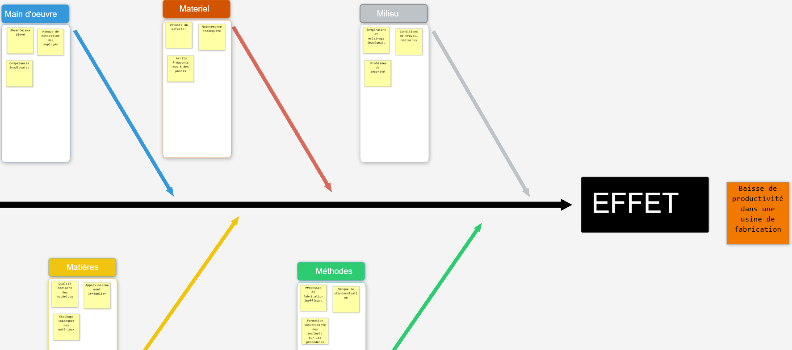

# LE DIAGRAMME ISHIKAWA

**Catégorie:** Résoudre des problèmes · **Phase:** Ouverture Exploration Fermeture · **Difficulté:** Intermédiaire · **Durée:** 60' · **Participants:** 5-15

## Objectif

Identifier les causes à un problème.

## Valeur ajoutée

Favorise l'analyse de résolution de problème en faisant participer une équipe. Facilite l'identification des causes potentielles en ciblant la recherche sur la base des 5 " M ".
	Le diagramme obtenu offre une vue globale et synthétique des problèmes.

## Résumé de la pratique

Le diagramme est utilisé comme outil d'identification des causes à un problème. Il se présente sous la forme d'arêtes de poissons en classant les causes par catégories. Les catégories peuvent être libres ou reposer sur des axes prédéfinis comme les 5M : Matière, Matériel, Méthodes, Main d'œuvre, Milieu.

## Materiel

- Paperboard
- Post-it
- Feutres.

## Déroulé de l'atelier

### Préparation
Dessiner une arête de poisson avec 5 axes :

- Matière,

- Matériel,

- Méthodes,

- Main d'œuvre,

- Milieu.

- Un sixième nommé " Mesure " peut être utilisé dans certains cas pour mettre en avant les problèmes de fiabilité du système de mesure.

L'atelier se déroule en 4 étapes

### Definition de la problématique
Formuler ensemble une problématique concise et spécifique.

Par exemple, "Identification des causes principales des retards dans nos developpements logiciel."

### Brainstorming sur les raisons potentielles
Pour chaque catégorie, faire un brainstorming pour recenser les causes potentielles

Vous pouvez utiliser la technique brainwriting : chaque participant écrit d'abord ses idées sur des post-its pour éviter l'influence des autres.

### Vote des causes critiques
Réaliser un vote pour faire ressortir les causes critiques. La quantité de points à attribuer par personne étant définie par le nombre d'idées à juger sera divisé par 3,

### Elaboration d'un plan d'action
Travailler sur les 3 causes qui ont recueillies le plus de votes.

## Astuce

Exemple  concret:

**Situation :** Une entreprise de développement logiciel fait face à des retards récurrents dans la livraison de ses projets.

**Étape 1 :** La problématique est définie comme : "Quelles sont les causes principales des retards dans nos projets de développement logiciel ?"

**Étape 2 :** L'équipe utilise le brainwriting pour recenser les causes potentielles sous chaque axe. Par exemple, sous "Main d'œuvre", une cause identifiée pourrait être "manque de compétences spécifiques".

**Étape 3 :** Chaque membre dispose de 5 points à attribuer aux causes qu'il considère comme les plus critiques. Les critères de vote sont l'impact sur les délais et la facilité de résolution.

**Étape 4 :** Les trois causes ayant reçu le plus de votes sont : "manque de compétences spécifiques", "processus de validation trop long" et "communication insuffisante entre les équipes". L'équipe élabore ensuite un plan d'action pour chaque cause, avec des responsables désignés et des délais pour la mise en œuvre des solutions.

## Source

Lean

---

📄 [Télécharger la fiche pratique (PDF)](https://atelier-collaboratif.com/fiche-pratique-28-le-diagramme-ishikawa.pdf)

🔗 [Voir sur L'Atelier Collaboratif](https://atelier-collaboratif.com/28-le-diagramme-ishikawa.html)