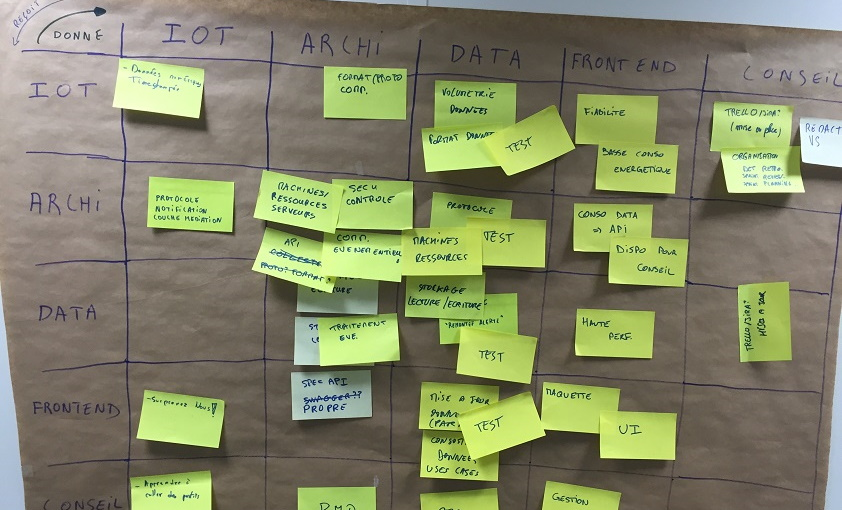

# LA MATRICE DES ATTENDUS

**Catégorie:** Résoudre des problèmes · **Phase:** Exploration Fermeture · **Difficulté:** Intermédiaire · **Durée:** 60'-120' · **Participants:** 5-30

## Objectif

Formaliser et échanger sur les attendus de chaque partie prenante du projet.

## Valeur ajoutée

Révèle les motivations et interactions entre les acteurs d'un système. Les acteurs peuvent tout aussi bien désigner des individus que des organisations entières.
	Cet atelier constitue un outil efficace, aidant les participants à explorer la valeur au sein d'un groupe.

## Résumé de la pratique

Chaque participant renseigne individuellement les attendus envers les autres acteurs : 1 attendu = 1 post-it. À tour de rôle, chacun vient coller ses attendus sur le tableau et les partage avec l'ensemble du groupe.

## Materiel

- Paperboard
- Post-it
- Feutres.

## Déroulé de l'atelier

### Préparation:
Disposer d'une liste comprenant tous les acteurs du système. Elle peut être préparée à l'avance ou dressée en début d'exercice. À l'aide de cette liste, le facilitateur dessine une matrice indiquant les noms des acteurs sur les axes vertical et horizontal. Chaque case de la matrice indique une information unique.

Pour une meilleure lecture, considérez que l'axe vertical signifie " de " et l'axe horizontal " à ".

### Reflexion individuelle *(10')*
Chaque participant renseigne individuellement les attendus envers les autres acteurs (1 attendu = 1 post-it) et également un post-it décrivant brièvement le but ou la raison pour laquelle il prend part au système.

### Echanges autour de la matrice *(50')*
Le facilitateur prend chaque point d'intersection et compare les perceptions de valeur entre les acteurs.

Commencer par un acteur donné et évoluer de case en case, en posant la question suivante : " Que puis-je vous offrir ? ". Certains points d'intersection seront faciles à décrire. D'autres, en revanche, confronteront des acteurs n'ayant jamais été liés ou étant en désaccord total.

Le but de la matrice est de révéler une vision d'ensemble quant aux bénéfices que chaque acteur peut apporter aux autres.

## Source

Gamestorming

---

📄 [Télécharger la fiche pratique (PDF)](https://atelier-collaboratif.com/fiche-pratique-29-la-matrice-des-attendus.pdf)

🔗 [Voir sur L'Atelier Collaboratif](https://atelier-collaboratif.com/29-la-matrice-des-attendus.html)