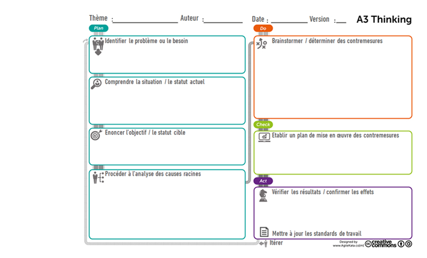

# A3 THINKING

**Catégorie:** Résoudre des problèmes · **Phase:** Ouverture Exploration Fermeture · **Difficulté:** Intermédiaire · **Durée:** 60' · **Participants:** 5-15

## Objectif

Permet d'identifier, résoudre et suivre un problème.

## Valeur ajoutée

Outil de communication synthétique. Permet de structurer l'analyse et favoriser l'esprit d'équipe sur une démarche de résolution de problèmes à tous niveaux hiérarchiques.

## Résumé de la pratique

L'A3 Thinking solving est utilisé pour analyser une problématique et pour trouver les solutions adaptées dans un court laps de temps. Construit par une équipe pluridisciplinaire, il décompose la problématique en plusieurs phases pour permettre de la traiter de manière efficace.

## Materiel

- Paperboard
- post-it
- feutres.

## Déroulé de l'atelier

### Plan
- Identifier le problème ou le besoin: Commencez par décrire de façon concise le problème à résoudre.

- Comprendre la situation :Recueillez des données et des informations pour comprendre la situation actuelle.

- Énoncer l'objectifDéfinissez l'objectif souhaité ou l'état futur à atteindre.

- Procéder à l'analyse des causes racines: Utilisez des outils commele diagramme d'Ishikawaoule 5 Pourquoipour identifier la cause profonde du problème

### Do
- Brainstormer:Générez des idéeset choisissez des actions correctives pour aborder les causes racines identifiées.

### Check
- Établir un plan d'actions: Développez un plan d'action détaillé pour mettre en œuvre les solutions choisies.

### Act
- Vérifier les résultats: Suivez et évaluez l'efficacité des actions correctives.

- Mettre à jour les standards de travail: Intégrez les nouvelles pratiques dans les standards opérationnels de l'organisation.

- Itérer: Répétez le processus en continu pour l'amélioration continu

## Source

Lean thinking - Toyota

## A télécharger

Modèle d'A3 Thinking (agilekata)

---

📄 [Télécharger la fiche pratique (PDF)](https://atelier-collaboratif.com/fiche-pratique-31-a3-thinking.pdf)

🔗 [Voir sur L'Atelier Collaboratif](https://atelier-collaboratif.com/31-a3-thinking.html)