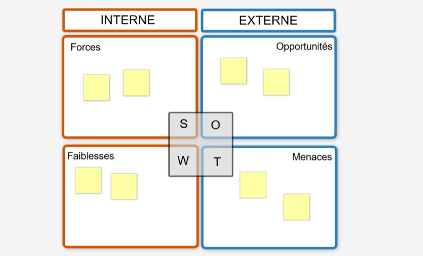

# MATRICE SWOT

**Catégorie:** Résoudre des problèmes · **Phase:** Ouverture Exploration · **Difficulté:** Intermédiaire · **Durée:** 60' · **Participants:** 3-10

## Objectif

Evaluer la situation d'un service, d'une équipe afin de définir une stratégie.

## Valeur ajoutée

Outil très connu et simple à mettre en œuvre

## Résumé de la pratique

Classer et prioriser les données externes en Menaces ou Opportunités et les données internes en Forces ou en Faiblesses . Ensuite tirer des actions à mener sur ces différents stratégiques.

## Materiel

- Paperboard
- Post-it
- Feutres.

## Déroulé de l'atelier

### Préparation
Au préalable, dessiner une matrice SWOT à deux dimensions sur un paper board avec :

- En interne  :  Forces, Faiblesses,

- En externe :  Opportunités , Menaces.

### Présentation du problème *(5')*
Présenter le problème ou le sujet à traiter sur le paperboard.

### Réflexion individuelle *(5')*
Demander à chaque participant de renseigner individuellement chaque catégorie (au moins un post it par catégorie).

### Partage *(40')*
Demander à chaque participant de positionner les post it sur la matrice et partager à l'ensemble du groupe leurs réflexions . Un échange a lieu avec le groupe.

## Astuce

Eviter les ressentis, faire orienter la réflexion sur des faits, des mesures.

Prioriser les faits (en utilisant la technique de la [gommettocratie](38-la-gommettocratie.html) par exemple

Commencer par l'analyse des faits externes et les classer en opportunités ou menaces.

---

📄 [Télécharger la fiche pratique (PDF)](https://atelier-collaboratif.com/fiche-pratique-33-matrice-swot.pdf)

🔗 [Voir sur L'Atelier Collaboratif](https://atelier-collaboratif.com/33-matrice-swot.html)