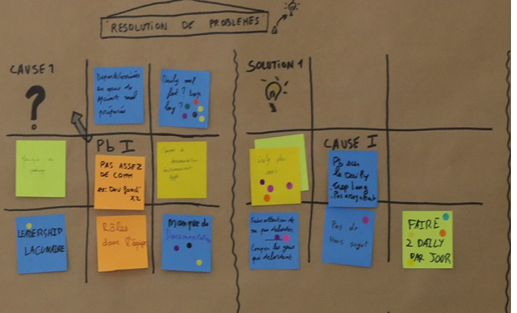

# LE LOTUS

**Catégorie:** Résoudre des problèmes · **Phase:** Ouverture Exploration Fermeture · **Difficulté:** Facile · **Durée:** 60-120' · **Participants:** 5-15

## Objectif

Etre dans une démarche d'amélioration continue.

## Valeur ajoutée

Permet de se focaliser sur la résolution d'un problème.

## Résumé de la pratique

La Fleur de Lotus permet de collecter puis explorer des problèmes en utilisant une représentation de type fleur de lotus.

## Materiel

- Brown paper
- Post-it de couleurs
- Feutres.

## Déroulé de l'atelier

### Afficher le problème initial *(5')*
Ecriver au centre du tableau la problématique . Elle peut être générique : " Quels sont les problèmes actuellement qui nous empêche d'avancer ?"

### Selectionner le problème à traiter en priorité *(15')*
Etape optionnelle, si le problème initial et prioritare a été identifié. Demander au groupe de manière individuelle d'écrire un problème qu'il trouve prioritaire sur un post-it Chaque participant vient coller son post-it (= un pétale) sur le tableau et expliquer sa problématique.

Faire voter ensuite les pétales les plus importants aux yeux des participants par la technique de la gommettocratie

### Sélectionner la cause du problème *(15')*
Ecrire la problématique choisie au centre d'un nouveau tableau. Demander au groupe de manière individuelle de chercher la cause de ce problème . Chaque participant vient coller et expliquer son post-it (son pétale) sur le tableau

Faire voter ensuite les pétales les plus importants aux yeux des participants par la technique de la gommettocratie

### Trouver et sélectionner une solution au problème *(15')*
De même que pour les étapes précédentes, travailler sur le pétale prioritaire sur les solutions en générant des pétales (post-it).

Faire voter les pétales les plus importantes aux yeux des participants par la technique de la gommettocratie

## Astuce

Si la problématiue est déjà identifiée, vous pouvez commencer la séquence à partir des causes racines

## Source

Inspiré du Lotus Blossum de Yasuo Matsumura

---

📄 [Télécharger la fiche pratique (PDF)](https://atelier-collaboratif.com/fiche-pratique-35-le-lotus.pdf)

🔗 [Voir sur L'Atelier Collaboratif](https://atelier-collaboratif.com/35-le-lotus.html)