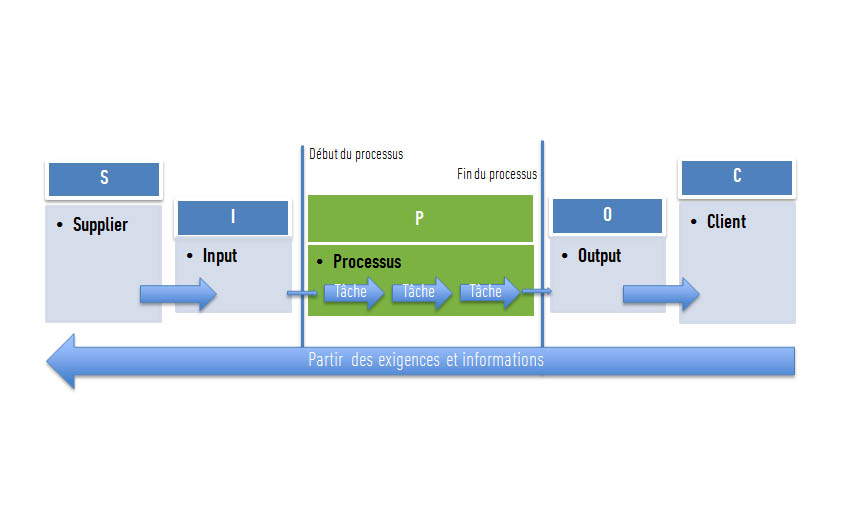

# SIPOC

**Catégorie:** Résoudre des problèmes · **Phase:** Fermeture · **Difficulté:** Expert · **Durée:** 60' · **Participants:** 5-15

## Objectif

Comprendre et améliorer les activités d'un processus ou d'une organisation,

## Valeur ajoutée

Sert a comprendre pourquoi un processus existe, et quelle est son objectif . Favorise la focalisation des efforts d'analyse

## Résumé de la pratique

SIPOC signifie S upplier, I nput, P rocess, O utput, C ustomer. Cette pratique est utilisée pour représenter les bornes des processus à améliorer et identifier les pratiques associées en se recentrant sur les attentes du client.

Le SIPOC se construit par questionnement: Où commence le processus? Comment fonctionne-t-il ? Où se termine le macro processus ?

## Materiel

- Paperboard
- post-it
- feutres.

## Déroulé de l'atelier

L'atelier se déroule en 5 étapes:
1.Identifierlepérimètredu processus à étudier,
2.Listerlessortiesdu process avec les clients associés,
3. Lister les entrées nécessaires auprocesset lesfournisseursassociés,
4. Identifier les élémentscritiquesenentréesetsorties,
5. Identifier lesindicateursde fiabilité desInputet Ouput critiques.

## Source

Lean

---

📄 [Télécharger la fiche pratique (PDF)](https://atelier-collaboratif.com/fiche-pratique-36-sipoc.pdf)

🔗 [Voir sur L'Atelier Collaboratif](https://atelier-collaboratif.com/36-sipoc.html)