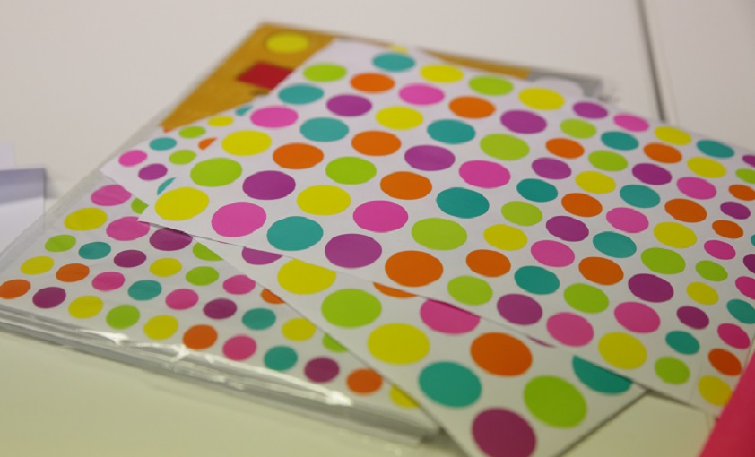

# LA GOMMETTOCRATIE

**Catégorie:** Prioriser / Décider · **Phase:** Fermeture · **Difficulté:** Facile · **Durée:** 5' · **Participants:** 3-50

## Objectif

Prioriser les tâches, idées sous la forme d'un vote.

## Valeur ajoutée

Permet à un groupe de focaliser la conversation sur les éléments du plus important au moins important.

## Résumé de la pratique

Les participants sont invités à placer une ou plusieurs gommettes sur les idées qui séduisent le plus.

## Materiel

- Gommettes

## Déroulé de l'atelier

En prérequis, le facilitateur expose les éléments qui doivent faire l'objet du vote.
Tous les éléments doivent êtrecompris par tout le monde.
Chaque participant dispose généralement de3 gommettes(chaque vote sera représentée par une gommette).
Le facilitateur demande aux membres du groupe de coller une ou plusieurs gommettes à côté des éléments qui les séduisent le plus.
Les éléments ayant eu le plus de votes seront alorstraités en priorité.

## Point de vigilance

Conseil  :Demander aux participants de ne pas voter pour leur propres idées!

## Variante

**Le Véto :**

En plus du vote par gommette, il est intéressant de laisser les participants exprimer un désaccord sur une idée ou une action.  Dans ce cas, vous pouvez mettre à disposition des gommettes de couleur ou de forme différentes représentant un véto.  Si un post-it rencontre un nombre maximum de votes mais avec un véto, celui-ci devra alors être obligatoirement discuté afin d'atteindre [le consentement.](43-decision-par-consentement.html)

## Source

Dot Voting

---

📄 [Télécharger la fiche pratique (PDF)](https://atelier-collaboratif.com/fiche-pratique-38-la-gommettocratie.pdf)

🔗 [Voir sur L'Atelier Collaboratif](https://atelier-collaboratif.com/38-la-gommettocratie.html)