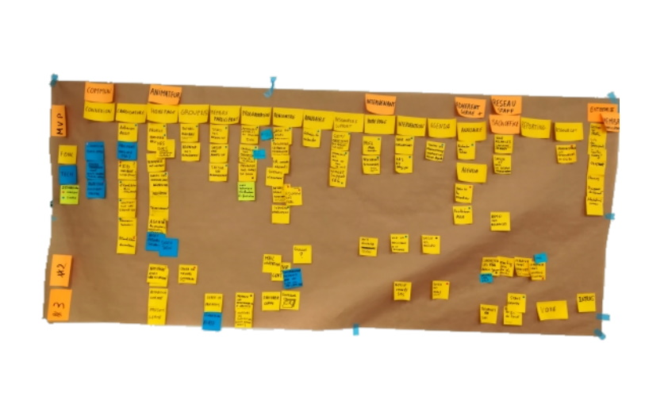

# STORY MAPPING

**Catégorie:** Prioriser / Décider · **Phase:** Fermeture · **Difficulté:** Expert · **Durée:** 120' · **Participants:** 3-15

## Objectif

Structurer la planification de versions d'un projet.

## Valeur ajoutée

Modérer le risque en mettant en œuvre un produit/service qui comporte des fonctionnalités de forte "valeur métier".

## Résumé de la pratique

Le "story mapping" consiste en une organisation en deux dimensions des fonctionnalités du produit.

* L'axe horizontal matérialise la succession (chronologique) des usages de l'utilisateur. * L'axe vertical matérialise la priorité des fonctionnalités.

En haut celles qui sont indispensables à l'usage, en bas celles qui sont annexes ou ne concernent qu'une fraction des flux d'informations que traite le produit.

## Materiel

- Brown paper
- post-it
- feutres

## Source

Jeff Patton

---

📄 [Télécharger la fiche pratique (PDF)](https://atelier-collaboratif.com/fiche-pratique-40-story-mapping.pdf)

🔗 [Voir sur L'Atelier Collaboratif](https://atelier-collaboratif.com/40-story-mapping.html)