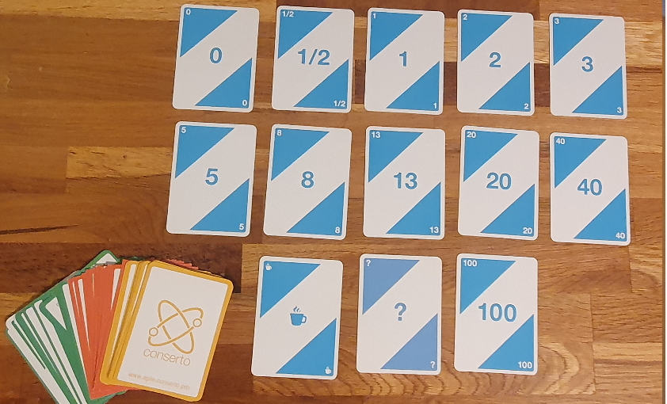

# LE PRODUIT ROI

**Catégorie:** Prioriser / Décider · **Phase:** Fermeture · **Difficulté:** Facile · **Durée:** 60' · **Participants:** 5-15

## Objectif

Prioriser les besoins MOA en calculant le ROI des fonctionnalités.

## Valeur ajoutée

Permet d'alerter la MOA sur des fonctionnalités coûteuses et de prioriser les fonctionnalités.

## Résumé de la pratique

Cette pratique consiste à mettre d'accord l'équipe métier et l'équipe de réalisation sur les fonctionnalités à réaliser en utilisant le planning poker.

## Materiel

- Feuilles A4
- Feutres
- Planning poker

## Déroulé de l'atelier

Former deux groupes : 1 groupe "Réalisateur/Developpeur" et un groupe "Métier"
Le facilitateur passe un à un l'ensemble des fonctionalités à pondérer en écrivant sur une fiche le titre de la fonctionnalité. (un modèle de fiche est téléchargeableici)
Pour cela, demander aux participants d'utiliserles cartes du planning pokerpour évaluer les fonctionalités au niveau fonctionnel et technique
Le groupe "métier" évalue chaque fonctionalité en terme de valeur métier .Si des contraintes fonctionnelles apparaissent, elles seront écrites sur la fiche
Le groupe "réalisateur/developpeur"évalue chaque fonctionalité en terme d'effort (complexité, temps passé). Si des contraintes techniques apparaissent, elles seront écrites sur la fiche.
Même principe que pour leplanning poker
Chaque participant abat une carte de notation.
Les participants ayant alloué la note la plus faible et la note plus forte justifient leur choix.
Chaque participant abat à nouveau une carte, c'est alors la moyenne de ces notes qui est prise en compte.
On note la valeur métier et l'effort à fournir de la fonctionalité concernée et son ROI
ROI = valeur métier / effort
Une fois leROIcalculé pour toutes les fonctionalités celles-ci sont alors priorisées naturellement.

## A télécharger

Modèle de fiche

---

📄 [Télécharger la fiche pratique (PDF)](https://atelier-collaboratif.com/fiche-pratique-42-le-produit-roi.pdf)

🔗 [Voir sur L'Atelier Collaboratif](https://atelier-collaboratif.com/42-le-produit-roi.html)