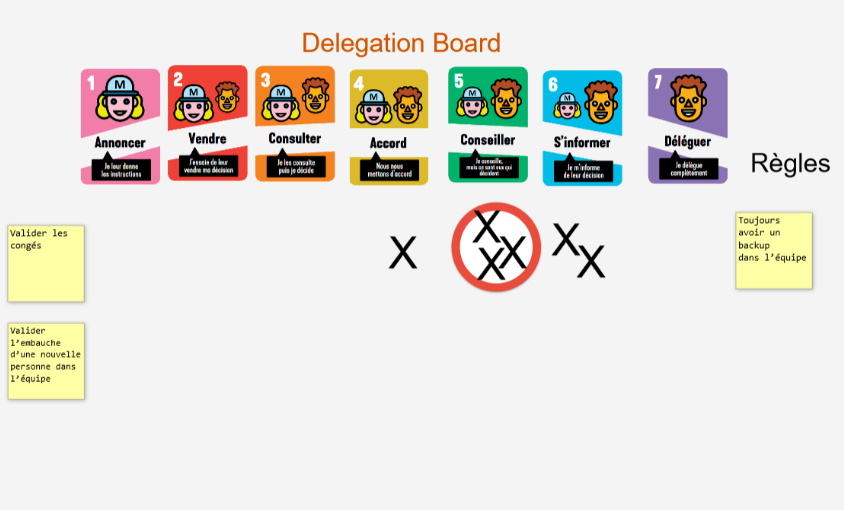

# LE DELEGATION POKER

**Catégorie:** Prioriser / Décider · **Phase:** Ouverture Exploration Fermeture · **Difficulté:** Intermédiaire · **Durée:** 60' · **Participants:** 3-7

## Objectif

Comprendre les différents niveaux de délégation.

## Valeur ajoutée

De façon ludique, permet d'ouvrir la discussion autour de la délégation au sein de son équipe.

## Résumé de la pratique

Engager une réflexion collective sur les différents niveaux de délégation sur des actions du quotidien en jouant aux cartes avec l'équipe.

## Materiel

- Un jeu de cartes de délégation poker par personne.

## Déroulé de l'atelier

### Préparation
Avant la session , assurez-vous que chaque participant dispose d'un jeu de cartes Delegation Poker. Chaque jeu doit contenir les 7 niveaux de délégation.

Expliquez brièvement le but du jeu et les différents niveaux de délégation pour s'assurer que tout le monde comprend les règles et l'objectif.

### Introduction de la situation
Le facilitateur présente une situation spécifique liée à la vie de l'équipe. Par exemple, "Qui valide les congés dans l'équipe ?" ou "Qui est responsable de l'embauche d'une nouvelle personne ?".

Clarifiez la situation si nécessaire, pour que tous les participants comprennent bien le contexte et les enjeux.

### Vote 2' par situation
Chaque participant choisit une carte qui représente le niveau de délégation qu'il considère approprié pour la situation donnée et la pose face cachée sur la table.

Une fois tous les votes effectués , les participants retournent leurs cartes simultanément pour révéler leur choix.

### Discussion 10' par situation
Échangez sur les choix de chacun . C'est l'occasion de comprendre les écarts de perception entre les membres de l'équipe. Pourquoi certains préfèrent-ils un niveau de délégation plus élevé ou plus bas ?

Encourage la discussion ouverte . C'est par le dialogue que l'équipe peut aligner ses attentes et comprendre les différentes perspectives.

### Consensus *(5')*
Après la discussion , l'équipe peut choisir de voter à nouveau ou d'arriver à un consensus sur le niveau de délégation approprié pour la situation discutée.

## Astuce

Poser les règles de l'équipe

Le **Delegation Poke** r est une opportunité précieuse pour revisiter et clarifier **les règles** qui régissent les processus et les prises de décision au sein de l'équipe.

Prenons un exemple concret : si, lors d'une session de Delegation Poker, l'équipe s'accorde sur un niveau 5 de délégation concernant la validation des congés, c'est le moment idéal pour discuter des règles spécifiques qui encadrent cette procédure. Quelles sont les conditions et les critères permettant à l'équipe de valider les congés de manière autonome ? Quelles sont les limites de cette autonomie ?

Delegation board

Vous pouvez consigner le résultat sur un "Delegation Board". Ce tableau devient un référentiel visuel des décisions prises, illustrant clairement les niveaux de délégation choisis pour chaque situation, accompagnés des règles correspondantes.

## Source

Jurgen Appelo (Management 3,0)

## A télécharger

Management30.com Delegation Poker en français

---

📄 [Télécharger la fiche pratique (PDF)](https://atelier-collaboratif.com/fiche-pratique-45-le-delegation-poker.pdf)

🔗 [Voir sur L'Atelier Collaboratif](https://atelier-collaboratif.com/45-le-delegation-poker.html)