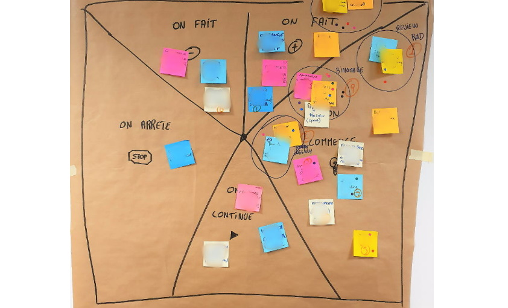

# L'ÉTOILE DE MER

**Catégorie:** S'améliorer · **Phase:** Ouverture Exploration Fermeture · **Difficulté:** Facile · **Durée:** 60-90' · **Participants:** 5-15

## Objectif

Décider des améliorations à mettre en œuvre pour faciliter le travail d'équipe.

## Valeur ajoutée

Rétrospective évitant l'effet manichéen "ça marche" versus "ça marche pas".
	Permet de challenger l'équipe et apporter de nouvelles idées tout en restant positif.

## Résumé de la pratique

Chacun des participants s'exprime sur un diagramme en forme d'étoile. Ce diagramme possède 5 axes : "on continue...", "on arrête...", "on fait moins de ...", "on fait plus de ...", "on tente..." A l'issue d'un vote , l'animateur peut commencer à établir un plan d'action avec le groupe.

## Materiel

- Paperboard
- Post-it
- Feutres
- Gommettes

## Déroulé de l'atelier

### Préparation *(15')*
Dessiner un diagramme en forme d'étoile de mer.

Expliquer de ce signifie chaque secteur :

- "On continue …" : Tout ce que l'on a aimé dans l'itération, tout ce qui a favorisé la collaboration et le résultat,

- "On arrête …" : Tout ce qui n'apporte aucune valeur ou qui entrave le fonctionnement de l'équipe,

- "On fait moins de …" : Les pratiques, les techno etc. qui mériteraient d'être affinées dans le contexte actuel,

- "On fait plus de …" : Les pratiques / techno etc. que dont on ne tire pas assez les bénéfices, qu'il faudrait améliorer,

- "On tente …" : Toutes les idées de nouvelles pratiques à mettre en place.

### Réflexion individuelle *(5')*
Chaque participant note silencieusement alors sur des post-it des idées pour compléter le diagramme. Un post par idée et par secteur

### Partage *(30-45')*
Les participants présentent à tour de rôle leurs idées.

Les idées similaires à d'autres post-it peuvent être regroupées.

### Vote et priorisation *(15')*
Demander ensuite aux participants de voter sur les idées qui leur semblent les plus importantes (par exemple en utilisant la technique de la gommettocratie ).

Commencer enfin à élaborer un plan d'actions avec le groupe (pas plus de 5 actions en général).

## Source

Star Fish retrospective (thekua.com@rest )

---

📄 [Télécharger la fiche pratique (PDF)](https://atelier-collaboratif.com/fiche-pratique-46-l-etoile-de-mer.pdf)

🔗 [Voir sur L'Atelier Collaboratif](https://atelier-collaboratif.com/46-l-etoile-de-mer.html)