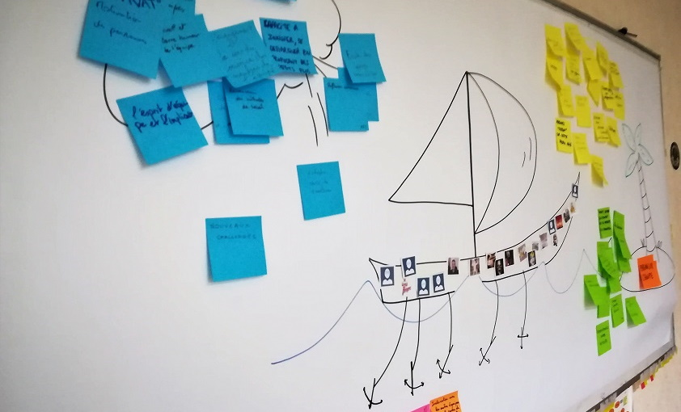

# LE SPEED BOAT

**Catégorie:** S'améliorer · **Phase:** Ouverture Exploration Fermeture · **Difficulté:** Intermédiaire · **Durée:** 60-90' · **Participants:** 5-50

## Objectif

Partager sur les freins et les leviers en utilisant l'analogie du bateau.

## Valeur ajoutée

Obtenir une vue d'ensemble des forces et des contraintes. Vérifier que les participants sont en phase avec l'objectif initial.

## Résumé de la pratique

Sur un bateau vers son objectif (une île), l'équipe va exprimer ce qui la freine (le vent) et ce qui la pousse (le moteur).

## Materiel

- Brownpaper
- Feutres
- Post-it de couleurs

## Déroulé de l'atelier

### Présention de l'objectif et de la métaphore *(5')*
Présenter la métaphore du bateau. L'utilisation de la métaphore du bateau favorise l'expression et l'échange.

### Génération des idées *(5')*
Chaque participant réfléchit individuellement au sujet pendant 5 minutes et renseigne  : 1 ou plusieurs post-it bleu pour les voiles, ce qui fait avancer l'équipe 1 ou plusieurs post-it rose pour les ancres, ce qui freine l'équipe vers son objectif 1 ou plusieurs post-it jaune pour le soleil (les remerciements ) 1 ou plusieurs post-it vert pour les récifs (les risques pour l'équipe que l'on imagine)

### Echange en groupe 30' à 60' en fonction du nombre de participants
Chaque participant vient coller à tour de rôle coller chaque post-it en exprimant chaque idée. Tous les participants qui ont formulé une idée similaire peuvent coller leur post-it au même endroit.

### Priorisation des idées *(10')*
Demander au groupe de voter pour les axes d’amélioration (ancres le plus souvent) qu’il pense les plus importants à mettre place. On distribuera généralement trois gommettes par participant (voir gommettocratie )

## Source

Luke Hohmann (Innovation Games)

---

📄 [Télécharger la fiche pratique (PDF)](https://atelier-collaboratif.com/fiche-pratique-48-le-speed-boat.pdf)

🔗 [Voir sur L'Atelier Collaboratif](https://atelier-collaboratif.com/48-le-speed-boat.html)