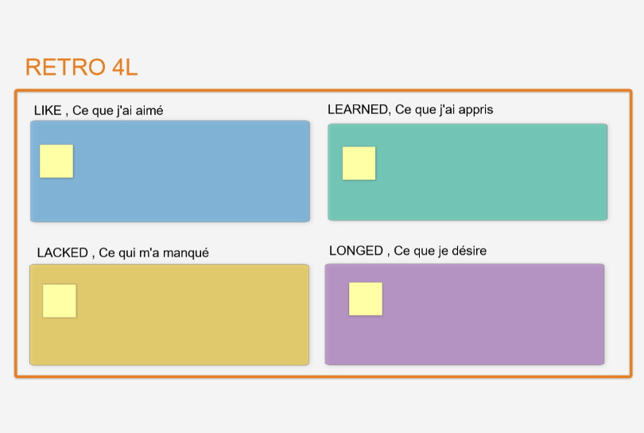

# LA RÉTROSPECTIVE 4L

**Catégorie:** S'améliorer · **Phase:** Ouverture · **Difficulté:** Facile · **Durée:** 30-60' · **Participants:** 5-15

## Objectif

Etre dans une démarche d'amélioration continue.

## Valeur ajoutée

Une autre façon de faire une rétrospective. Utile dans le cadre d'une formation

## Résumé de la pratique

Demander aux participants de lister les forces et les connaissances de l'équipe d'une part et ses axes d'amélioration.

## Materiel

- Brownpaper
- Post-it
- feutres.

## Déroulé de l'atelier

### Préparation
Afficher 4 feuilles correspondant aux thèmes : - Liked : ce que j'ai aimé dans cette itération, - Learned : ce que j'ai appris durant cette itération, - Lacked : ce qui m'a manqué pour mieux travailler durant cette itération, - Longed For : ce que je désire pour l'itération à venir.

### Générer des idées *(10')*
Demander à chacun des membres de l'équipe d'écrire silencieusement un ou plusieurs post-its par thème.

### Restitution *(15-30')*
Chaque participant colle ses post-it sur chaque tableau.

L'idéal est de commencer par Liked, puis Learned, Lacked pour finir sur Longed For.

### Synthèse *(10-20')*
Faire une synthèse et monter un plan d'actions avec le groupe.

## Variante

Pour un groupe important, la rétrospective 4L peut très bien se combiner avec un [World Café](58-world-cafe.html) en faisant 4 groupes.

Vous pouvez également notamment lors d'une fin d'une séquence pédagogique utiliser la rétrospective **MATA** !

Ce qui m’a M arqué Ce que j’ai A imé Ce que je vais T ransposer Ce que j’ai A ppris

## Source

Mary Gorman and Ellen Gottesdiener

---

📄 [Télécharger la fiche pratique (PDF)](https://atelier-collaboratif.com/fiche-pratique-49-la-retrospective-4l.pdf)

🔗 [Voir sur L'Atelier Collaboratif](https://atelier-collaboratif.com/49-la-retrospective-4l.html)