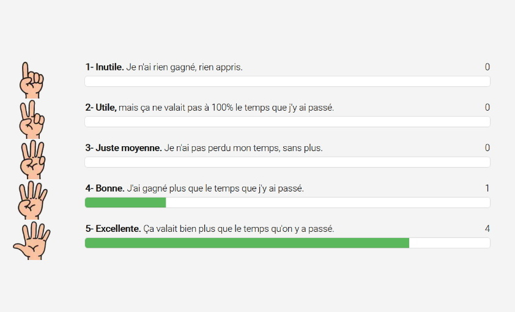

# LE ROTI AGILE

**Catégorie:** S'améliorer · **Phase:** Fermeture · **Difficulté:** Facile · **Durée:** 1' · **Participants:** 5-50

## Objectif

Avoir un feedback à chaud d'une réunion, d'un atelier.

## Valeur ajoutée

Moyen simple et rapide de faire un feedback des participants sur un atelier ou une réunion.

## Résumé de la pratique

R.O.T.I : Return On Time Invested. Evaluer le retour sur le temps investi, à la fin d'une réunion ou d'un atelier, sur une échelle de 1 à 5 en faisant voter chaque participant à main levée.

## Source

Lean Thinking

## Et à distance

L'atelier collaboratif vous propose de faire votre ROTI en ligne !

Lancer un ROTI en ligne

---

📄 [Télécharger la fiche pratique (PDF)](https://atelier-collaboratif.com/fiche-pratique-50-le-roti-agile.pdf)

🔗 [Voir sur L'Atelier Collaboratif](https://atelier-collaboratif.com/50-le-roti-agile.html)