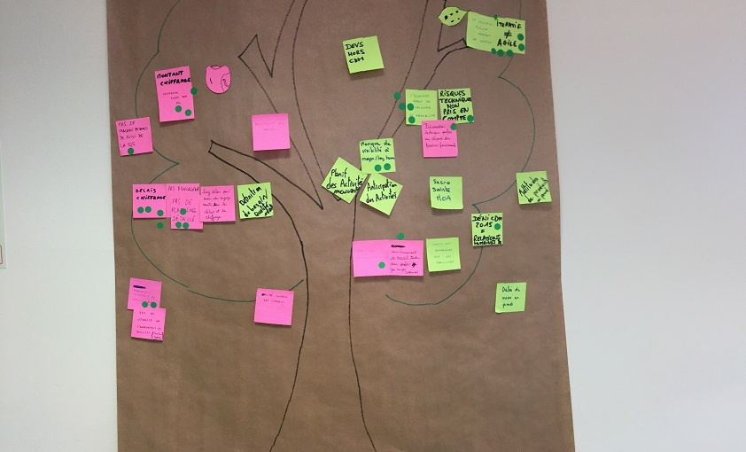

# L'ARBRE À POST-IT

**Catégorie:** S'améliorer · **Phase:** Ouverture Exploration · **Difficulté:** Facile · **Participants:** 5-50

## Objectif

Partager visuellement les problèmes et encourager les solutions.

## Valeur ajoutée

Donne la parole à l'équipe.
	Interpelle le manager et l'équipe.
	Permet d'identifier des sujets d'amélioration ou d'innovation.

## Résumé de la pratique

Représenter visuellement dans un des lieux de vie de l'équipe un arbre sur lequel chaque membre pourra venir déposer les problèmes qu'il rencontre (post-it rose) ou les idées/solutions (post-it vert).

## Materiel

- Paperboard
- Post-it verts et roses
- Feutres.

## Déroulé de l'atelier

Dessiner un arbre sur un paper board et demander aux participants de déposer
1-les problèmesqu'ils rencontrent sont ecrits sur un post-it rose
2-les idées/solutionssont ecrits sur un un post-it vert.
Cet outil demanagement visuelfacilite la collaboration et l'échange.
Il permet à l'équipe " d'évacuer " les difficultés qu'elle rencontre et de se focaliser sur ses missions.
Cet arbre peut également accueillir uniquement des idées.
Cet arbre peut être utilisé lors d'un séminaire qui pourra être alimenté tout au long de la journée.

---

📄 [Télécharger la fiche pratique (PDF)](https://atelier-collaboratif.com/fiche-pratique-51-l-arbre-a-post-it.pdf)

🔗 [Voir sur L'Atelier Collaboratif](https://atelier-collaboratif.com/51-l-arbre-a-post-it.html)