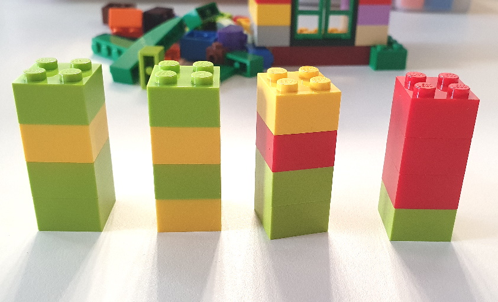

# LA TOUR DES ÉMOTIONS

**Catégorie:** Briser la glace · **Phase:** Ouverture · **Difficulté:** Facile · **Durée:** 1' · **Participants:** >3

## Objectif

Créer une tour en Lego représentant l'historique du moral de l'équipe jour après jour

## Valeur ajoutée

Permet une représentation visuelle en 3D de l'évolution du moral de l'équipe pendant une période donnée. A utiliser par exemple en début de rétrospective

## Résumé de la pratique

À la fin de la journée, invitez chaque membre de l'équipe à choisir une brique Lego© représentative de son état d'esprit. Chaque couleur correspond à un type d'émotion spécifique. Les participants empilent ensuite leur brique sur celles des autres, formant ainsi une tour. Cette tour symbolise le paysage émotionnel collectif de l'équipe à la fin de la journée.

## Materiel

- Briques de Lego©

## Déroulé de l'atelier

### Construction de la tour
Mettre à disposition des briques de Lego© de même taille réprésentant pour chaque couleur une émotion différente.

Afficher la correspondance couleur / émotion sur une feuille de papier

exemple :

- brique verte : Très bonne journée

- brique bleue : Bonne journée

- brique jaune : Journée juste moyenne

- brique rouge: Journée difficle

- brique violette: Très mauvaise journée

Demander que chaque soir, chaque membre de l'équipe choisisse une brique et la place sur la tour. Un étage de la tour correspond alors à une journée.

### Débrief
Demander à chaque participant de s'exprimer sur les bons et moins bons moments passés durant la période en prenant pour support la tour des émotions.

## Variante

Si vous n'avez pas de Lego, vous pouvez utiliser des gommettes de différentes couleurs Lors d'un séminaire par exemple, il est possible de faire l'exercice en début  et en fin de journée.

## Source

Inspiré du Niko Niko

---

📄 [Télécharger la fiche pratique (PDF)](https://atelier-collaboratif.com/fiche-pratique-55-la-tour-des-emotions.pdf)

🔗 [Voir sur L'Atelier Collaboratif](https://atelier-collaboratif.com/55-la-tour-des-emotions.html)