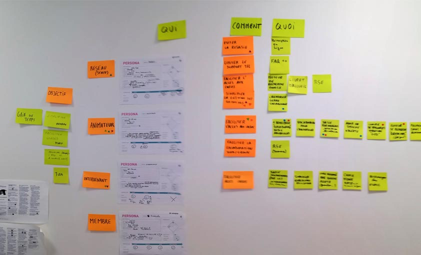

# IMPACT MAPPING

**Catégorie:** Partager la vision · **Phase:** Ouverture Exploration Fermeture · **Difficulté:** Intermédiaire · **Durée:** >120' · **Participants:** >3

## Objectif

Représenter visuellement les impacts et hypothèses de développement d'un produit.

## Valeur ajoutée

Outil permettant de construire la vision et les choix stratégiques d'une entreprise ou d'un produit

## Résumé de la pratique

Représenter un arbre de décisions en répondant aux questions suivantes : Pourquoi, Qui, Comment, Quoi

## Materiel

- Brownpaper
- Post-it
- Feutres.

## Déroulé de l'atelier

### Trouver et quantifier l'objectif *(30-60')*
Demander à chaque participant d'écrire l'objectif du produit ou de l'entreprise sur un post-it (le pourquoi). L'objectif doit être SMART (Simple, Mesurable, Accepté, Réaliste, Temporel)

Dessiner ensuite une ligne de temps sur un brown paper et demander à chaque participant d'exprimer ce qui est pour lui l'objectif et de le placer sur la ligne de temps en fonction des autres objectifs. Regrouper les objectifs si besoin

Une fois que chacun s'est exprimé, demander au groupe de choisir un objectif si possible à court terme. Vous pouvez utiliser le vote par gommettocratie par exemple

### Construire la carte d'impact mapping *(60')*
Il s'agit ici de construire une arborescence commençant par le Pourquoi, le Qui puis le Comment

Ecrire sur  le brown paper, l'objectif qui a été décidé.

Demander de lister les acteurs (QUI) qui peuvent influencer positivement ou négativement sur l'objectif.

Demander ensuite pour chaque acteur de définir COMMENT il pourrait être impacté et nous aider ou non dans l'atteinte de l'objectif (COMMENT)

### Créer des hypothèses *(15')*
Demander aux participants de sélectionner un impact (comment). Pour cela, choisir une pratique de décision collective comme " la gommettocratie " par exemple)

### Imaginer les grandes fonctionnalités *(60')*
Demander aux participants d'établir les activités et les fonctionnalités à mettre en œuvre (QUOI) sur l'impact sélectionné.

De même afin de prioriser les grandes fonctionnalités, utiliser par exemple le vote par " gommettocratie "

## Astuce

Après l'IMPACT MAPPING, vous pouvez commencer à décrire plus précisement la roadmap en utlisant par exemple le [STORY MAPPING](https://www.atelier-collaboratif.com/40-story-mapping.html)

L'IMPACT MAPPING permet de poser des hypothèses et de se donner des activités pour un objectif donné dans  un temps donné. Si les hypothèses se révèlent erronées, le groupe peut alors reprendre la carte et la remettre à jour en posant d'autres hypothèses, c'est à dire un autre chemin.

## Source

Gojko Adzic

## A télécharger

L'impact Mapping en une page

---

📄 [Télécharger la fiche pratique (PDF)](https://atelier-collaboratif.com/fiche-pratique-57-impact-mapping.pdf)

🔗 [Voir sur L'Atelier Collaboratif](https://atelier-collaboratif.com/57-impact-mapping.html)