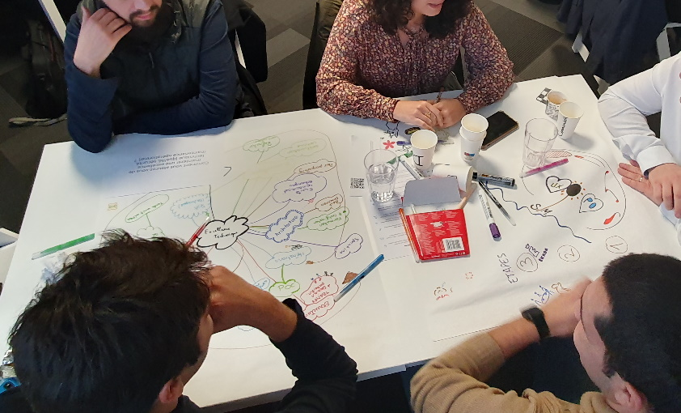

# WORLD CAFÉ

**Catégorie:** Générer des idées · **Phase:** Exploration · **Difficulté:** Facile · **Durée:** 120' · **Participants:** 10-300

## Objectif

Faire émerger des idées concrètes partagées par tous en s'appuyant sur l'intelligence collective.

## Valeur ajoutée

Basé sur le principe de pollinisation des idées, pratique phare de l'intelligence collective !

## Résumé de la pratique

Inviter les participants à faire émerger des propositions en groupes de 4/5 personnes autour d'une table puis à les faire changer de table régulièrement afin de venir compléter les idées des uns avec celles des autres.

## Materiel

- Tables
- Feutres
- Papier A3
- Post-it
- Flipchart si besoin (un par table)

## Déroulé de l'atelier

### Préparation
Définir la ou les questions à poser. On proposera une question ou une thématique par table.

Définir le nombre d'itérations et la durée des echanges pour chaque itération.

Chaque itération ne devrait pas prendre plus de 25'

Préparer ensuite chaque table avec des crayons-feutres, des post-it, des feuilles A3, des post-its.

### Présenter le principe du World Café - *(10 ')*
Inviter les participants à s’asseoir aux tables en groupes de 4 ou 5.

Faire en sorte que les participants qui se connaissent bien ou qui travaillent dans le même service ne se retrouvent pas sur une même table.

Demander pour chaque table que l'on nomme un maître de table, les autres participants seront les ambassadeurs.

Seuls les abassadeurs changent de table tandis que le maître de table reste à sa place afin d'animer et faire la synthèse.

Exposer la ou les questions que vous avez préparées  en les affichant à un endroit de la salle visible par tous.

Expliquer qu'il y aura par exemple 3 itérations de 15' et qu'à chaque itération tous les ambassadeurs changeront de table.

### Echanges - Itération entre 15 et *(25')*
Pendant l’itération, inciter les groupes à participer et communiquer leurs idées par oral et par écrit (schéma, dessin, mind mapping...)

5 minutes avant la fin de l’itération, indiquer le temps restant.

A la fin de l’itération, inviter les ambassadeurs à passer vers  une autre table.

Demander au maître de table de faire une « mini synthèse » (1 minute) des échanges aux nouveaux ambassadeurs

Faire de même pour les itérations suivantes

### Synthèse 5’ max par table
Les itérations terminées, inviter les maîtres de table à prendre la parole et faire ressortir les principales idées.

Noter les idées sur un paper board si besoin ou mieux filmez les interventions !

Récupérer les feuilles sur les tables afin de les utiliser pour un compte rendu par exemple.

## Point de vigilance

**Pièges à éviter**

Faire trop d'itérations Ne pas expliquer suffisamment aux maîtres de table leur rôle. Ne pas faire la synthèse à la fin des itérations

Il ne s'agit pas ici de prendre des décisions mais bien de générer des idées sur un sujet donné

## Source

Juanita Brown, David Isaacs (Shaping Our Futures Through Conversations That Matters.)

---

📄 [Télécharger la fiche pratique (PDF)](https://atelier-collaboratif.com/fiche-pratique-58-world-cafe.pdf)

🔗 [Voir sur L'Atelier Collaboratif](https://atelier-collaboratif.com/58-world-cafe.html)