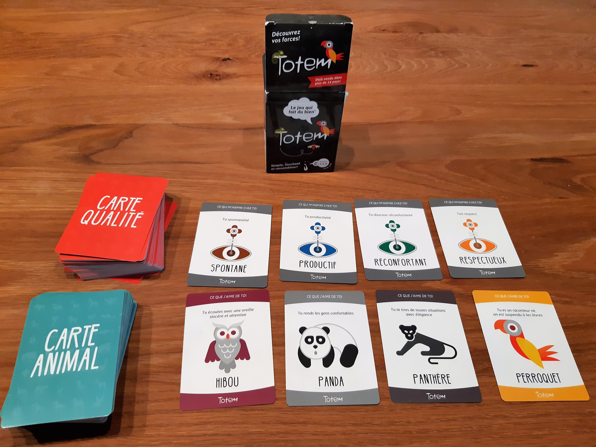

# TOTEM

**Catégorie:** Briser la glace · **Phase:** Ouverture · **Difficulté:** Facile · **Durée:** 15' · **Participants:** 4-10

## Objectif

Créer ou recréer des liens positifs entre les membres de l'équipe

## Valeur ajoutée

Permet à chacun de prendre ou reprendre confiance en ses qualités par l'intermédiaire du groupe.
	
		Reconnaître les autres et de leur exprimer sa gratitude.

## Résumé de la pratique

Le facilitateur invite les participants à choisir une carte " Animal " et une carte " Qualité " du jeu "Totem" qui correspond le mieux au trait de caractère de son collègue.

## Materiel

- Le jeu de cartes Totem

## Déroulé de l'atelier

### Principe du jeu
Chaque participant reçoit 7 cartes Animal et 7 cartes Qualité .

À tour de rôle, les participants choisissent une carte Animal et une carte Qualité pour un membre du groupe, constituant ainsi son Totem.

La personne concernée récupère les cartes et les lit à haute voix. Par exemple: S i un participant choisit la carte Animal "Kangourou", il pourrait dire : « Ce que j’aime chez toi , c’est que tu as plus d’un tour dans ton sac. » S'il choisit la carte Qualité "Constant", il pourrait ajouter : « Ce qui m’inspire chez toi, c’est ta constance. »

Les participants sont encouragés à étayer et illustrer leur choix avec des exemples. Ensuite, la personne peut exprimer son ressenti et choisir une carte Animal et une carte Qualité parmi les cartes à sa disposition pour constituer son Totem.

## Variante

En version accélérée, vous pouvez utiliser uniquement une carte , soit les cartes **Animal** , soit les cartes **Qualité.**

## Source

[Le jeu de cartes Totem - le jeu qui vous veut du bien](https://boutique.equipetotem.com/)

---

📄 [Télécharger la fiche pratique (PDF)](https://atelier-collaboratif.com/fiche-pratique-62-totem.pdf)

🔗 [Voir sur L'Atelier Collaboratif](https://atelier-collaboratif.com/62-totem.html)