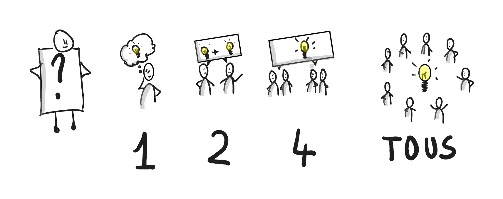

# 1 2 4 TOUS

**Catégorie:** Prioriser / Décider · **Phase:** Ouverture Exploration Fermeture · **Difficulté:** Facile · **Durée:** 12' · **Participants:** >8

## Objectif

Cocréer des solutions sur une thématique.

## Valeur ajoutée

Permet d'impliquer tous les participants dans l'élaboration d'une solution sans crainte ni pression.

	Permet ainsi une meilleur acceptation de la solution.

## Résumé de la pratique

Les participants réfléchissent au sujet d'abord individuellement puis par deux, puis par quatre et enfin tous ensemble.

## Materiel

- Feuille de papier
- stylo
- post-it

## Déroulé de l'atelier

### Réflexion individuelle *(1')*
Inviter les participants à réfléchir individuellement sur la problématique et noter leurs idées.

### En binôme *(2')*
Inviter les participants à faire des binômes et générer des idées à partir des réflexions individuelles.

### Par groupe de 4 *(4')*
Former des groupes de 4 (2 paires de binômes) et inviter chaque groupe à mettre en commun les idées.

### Tous ensemble *(5')*
Demander à l'ensemble des participants les principales idées qui ressortent des groupes de 4.

## Point de vigilance

Le « 1-2-4-TOUS » est une activité qui doit être rapide (12 minutes). La question doit donc être claire et servir un objectif afin de créer un consensus.

## Variante

Il est possible de répéter la pratique plusieurs fois avec des questions différentes. Si le sujet est plus complexe, il est également possible de donner plus de temps en multipliant les temps par deux par exemple.

## Source

Liberating Structure

## Et à distance

Pour pouvoir organiser des sous groupes, l'atelier collaboratif vous permet de créer des salles virtuelles et de vous y déplacer facilement.

Démarrer un atelier en ligne

---

📄 [Télécharger la fiche pratique (PDF)](https://atelier-collaboratif.com/fiche-pratique-63-1-2-4-tous.pdf)

🔗 [Voir sur L'Atelier Collaboratif](https://atelier-collaboratif.com/63-1-2-4-tous.html)