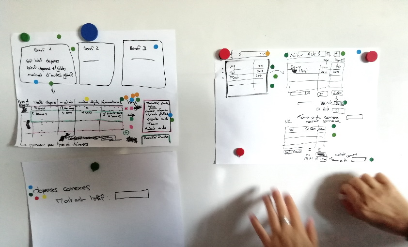

# DESIGN STUDIO

**Catégorie:** Générer des idées · **Phase:** Ouverture Exploration Fermeture · **Difficulté:** Intermédiaire · **Durée:** 60' · **Participants:** 3-25

## Objectif

Générer un maximum idées en un minimum de temps

## Valeur ajoutée

L'approche Design Studio permet d’embarquer tous les participants dans la conception d'un produit. Idéal pour construire une maquette d'écran.

## Résumé de la pratique

Exercice de brainstorming collaboratif en trois itérations, où les participants, répartis en petits groupes, dessinent des solutions à une problématique donnée, partagent et évaluent les idées au sein du groupe, puis votent pour la meilleure solution.

## Materiel

- Feuille A3
- Post-it
- Feutres.

## Déroulé de l'atelier

### Lancement *(5')*
Expliquer la problématique et s'assurer qu'elle est comprise par tout le monde.

Expliquer qu'il faudra penser et dessiner la solution.

Plier une feuille A3 en 4 pour obtenir 4 zones

Faire des groupes de 3 à 5 personnes.

### Première itération *(15')*
Demander à chaque participant de dessiner une idée par zone (5 minutes)

Ensuite, chaque participant présente ses 4 idées au groupe. (1 minute) Le groupe donne son avis sur les idées présentées. (1 minute). Le facilitateur veille que les critiques du groupe soient constructives.

### Deuxième itération *(15')*
On refait une autre itération en se nourissant des échanges du groupe.

Une troisième itération peut etre réalisée si besoin

### Vote *(5')*
Demander au groupe de voter pour la meilleure solution en utilisant par exemple la gommettocratie

## Source

Brian Sullivan

---

📄 [Télécharger la fiche pratique (PDF)](https://atelier-collaboratif.com/fiche-pratique-64-design-studio.pdf)

🔗 [Voir sur L'Atelier Collaboratif](https://atelier-collaboratif.com/64-design-studio.html)