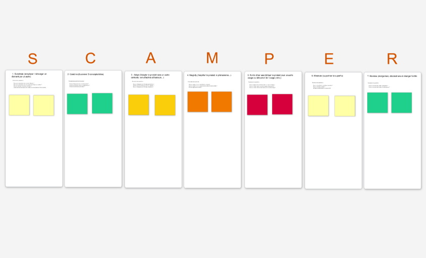

# SCAMPER

**Catégorie:** Générer des idées · **Phase:** Ouverture · **Difficulté:** Intermédiaire · **Durée:** 90' · **Participants:** 3-25

## Objectif

Trouver des idées à travers différents angles

## Valeur ajoutée

Stimule la créativité en se basant sur une checklist plutôt que de partir d'une feuille blanche

## Résumé de la pratique

La méthode S.C.A.M.P.E.R. permet au travers d'une série de 7 questions de repenser une solution, un concept, un problème en l'abordant sous différents angles.

## Déroulé de l'atelier

### S ubstitute : remplacer / échanger un élement par un autre
Exemple de questions :

- Peut-on le remplacer par un autre élement ?

- Peut-on le remplacer par une autre technologie ou matière ?

- Peut-on changer la couleur, la forme ?

- Quels autres produits peut-on utiliser en remplacement ?

### C ombine : fusionner 2 concepts/idées
Exemple de questions à se poser :

- Peut-on l'associer avec un autre produit?

- Peut-on combiner plusieurs compétences ?

- Peut-on combiner le processus ?

### A dapt : Adapter le produit dans un autre contexte, vers d'autres utilisateurs...

### M agnify: amplifier le produit, le phénomène...

### P ut to other use : Utiliser le produit pour un autre usage ou détourner de l'usage prévu
Exemples de questions :

### E liminate - supprimer le superflu
Exemples de questions  :

- Peut-on simplifier le problème, le produit ?

- Peut-on réduire sa taille ?

- Qu'est ce qu'est superflu ou peu utile?

### R everse : réorganiser, déconstruire et changer l'ordre
Exemples de questions :

- Peut-on inverser les causes et les effets ?

- Peut-on inverser les forces et les faiblesses ?

## Source

Alex Osborn & Bob Eberle, "Scamper Games for Imagination Development".

---

📄 [Télécharger la fiche pratique (PDF)](https://atelier-collaboratif.com/fiche-pratique-65-scamper.pdf)

🔗 [Voir sur L'Atelier Collaboratif](https://atelier-collaboratif.com/65-scamper.html)