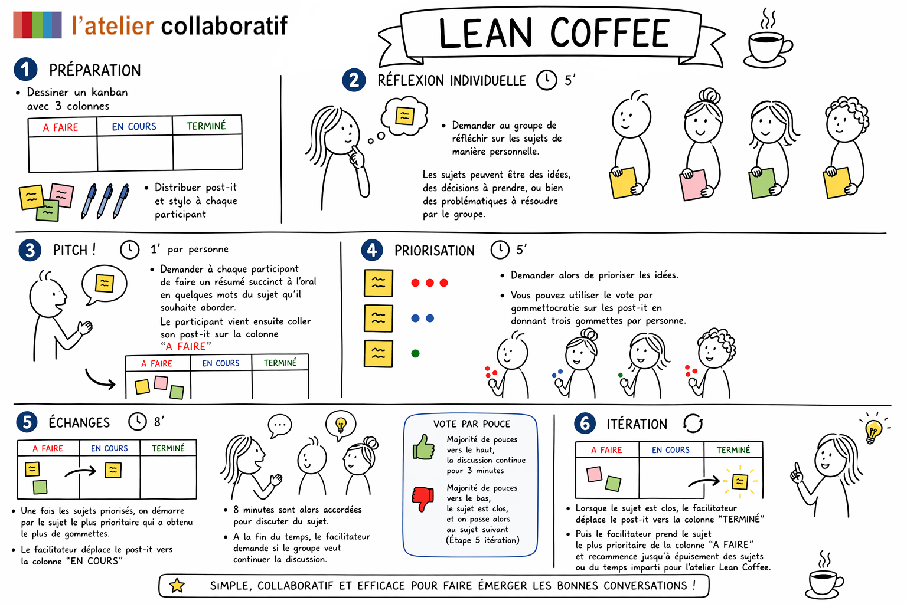

# LEAN COFFEE

**Catégorie:** Résoudre des problèmes · **Phase:** Ouverture Exploration · **Difficulté:** Facile · **Durée:** 60' · **Participants:** 3-10

## Objectif

Partager de la connaissance, des idées ou prendre des décisions en lien avec les attentes des participants

## Valeur ajoutée

Le lean coffee permet de cadrer les échanges sur des sujets proposés par le groupe dans un temps donné. Peut-etre utilisé à la fin d'une formation.

## Résumé de la pratique

Les participants identifient puis sélectionnent et priorisent ensemble l’ordre du jour en début d'atelier. La discussion commence avec le sujet le plus prioritaire. Au bout de 8 minutes, le groupe décide ou non de continuer la discussion.

3 minutes supplémentaires sont alors accordées si le groupe décide de continuer, sinon, le sujet suivant est alors abordé par le groupe.

## Materiel

- Brown paper
- post-it
- crayons

## Déroulé de l'atelier

### Préparation
Dessiner un kanban, c'est à dire un tableau avec trois colonnes dont les titres de chaque colonne sont les suivantes : "A FAIRE" , "EN COURS" , "TERMINÉ". Distribuer post-it et stylo à chaque participant

### Réflexion individuelle *(5')*
Demander au groupe de réflechir sur les sujets de manière personnelle. Les sujets peuvent être des idées, des décisions à prendre, ou bien des problématiques à résoudre par le groupe.

### Pitch ! 1' par personne
Demander à chaque participant  de faire un résumé succint à l'oral en quelques mots du sujet qu'il souhaite aborder. Le participant vient ensuite coller son post-it sur la colonne " A FAIRE "

### Priorisation *(5')*
Demander alors de prioriser les idées. Vous pouvez utiliser le vote par gommettocratie sur les post-it en donnant trois gommettes par personne.

### Echanges *(8')*
Une fois les sujets priorisés, on démarre par le sujet le plus prioritaire qui a obtenu le plus de gommettes. Le facilitateur vient alors déplacer le post-it vers la colonne " EN COURS "

8 minutes sont alors accordées pour discuter du sujet.

A la fin du temps, le facilitateur demande si le groupe veut continuer la discussion. Un vote par pouce peut être réalisé.

- Majorité de pouces vers le haut,  la discussion continue pour3 minutes

- Majorité de pouces vers le bas, le sujet est clos, et on passe alors au sujet suivant (Etape 5 itération)

### Itération
Lorsque le sujet est clos, le facilitateur déplace le post-it vers la colonne " TERMINÉ "

Puis le facilitateur prend le sujet le plus prioritaire de la colonne "A FAIRE" et recommence jusqu'à épuisement des sujets ou du temps imparti pour l'atelier Lean Coffee.

## Source

Inventé en 2009 par Jim Benson et Jeremy Lightsmith

---

📄 [Télécharger la fiche pratique (PDF)](https://atelier-collaboratif.com/fiche-pratique-71-lean-coffee.pdf)

🔗 [Voir sur L'Atelier Collaboratif](https://atelier-collaboratif.com/71-lean-coffee.html)