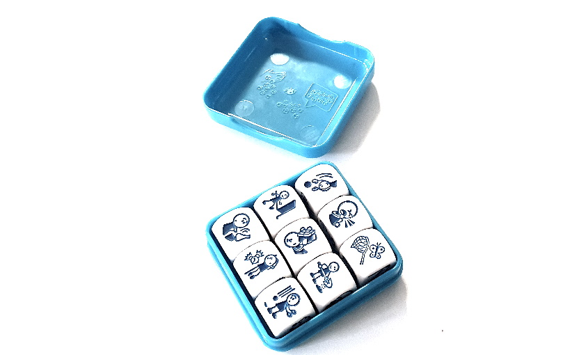

# STORY CUBES®

**Catégorie:** Briser la glace · **Phase:** Ouverture · **Difficulté:** Facile · **Durée:** 5' · **Participants:** <10

## Objectif

Partager son état d'esprit avec le groupe

## Valeur ajoutée

Moyen ludique pour encourager la discussion sur son état d'esprit ou sur un sujet

## Résumé de la pratique

Demander à chacun des participants de lancer les Story Cubes® et de raconter une histoire qui correspond aux dés tirés

## Materiel

- Story Cubes®

## Déroulé de l'atelier

### La question
Poser une question assez générique du type : "Aujourd'hui, je me sens comme..", "Les semaines passées ont été comme.."

La question doit être suffisament ouverte et porte généralement sur un ressenti.

### Pour chaque participant 2' par participant
Demander à chaque participant de lancer les Story Cubes®. Chaque face du cube possède un dessin.

A partir du tirage, le participant répond à la question en racontant une histoire à partir d'au moins 3 dés qu'il aura choisi.

## Variante

Vous pouvez également demander à toute l'équipe de raconter son histoire.  Pour cela, lancer tous les Story Cube et demander à tour de rôle de choisir un dé et de raconter une histoire

## Source

[Rory's Story Cubes](https://www.storycubes.com/)

## Et à distance

Il existe une version du jeu en ligne ici: https://davebirss.com/storydice/ Dans ce mode de jeu, vous pouvez choisir de tirer 5 ou 9 dés.

---

📄 [Télécharger la fiche pratique (PDF)](https://atelier-collaboratif.com/fiche-pratique-77-story-cubes.pdf)

🔗 [Voir sur L'Atelier Collaboratif](https://atelier-collaboratif.com/77-story-cubes.html)