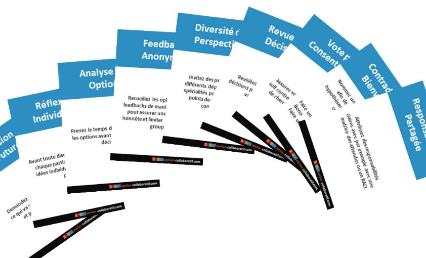

# BIAIS COGNITIFS

**Catégorie:** Prioriser / Décider · **Phase:** Ouverture · **Difficulté:** Intermédiaire · **Participants:** 2-20

## Objectif

Eviter la pensée de groupe

## Valeur ajoutée

Prendre conscience des biais cognitifs qui peuvent exister dans un groupe

## Résumé de la pratique

Utiliser un jeu de cartes pour identifier et contrer les biais cognitifs durant les réunions, favorisant ainsi des discussions plus objectives et constructives.

## Materiel

- jeu de cartes "biais cognitifs"

## Déroulé de l'atelier

### Préparation
Télécharger le jeu de cartes dédié aux biais cognitifs.

Les cartes de couleur verte représentent différents biais cognitifs. Les cartes bleues, quant à elles, proposent des stratégies pour les contrer.

Disposez les cartes sur la table avant le début de la réunion, en séparant les cartes vertes des cartes bleues pour faciliter leur identification.

### Pendant la Réunion
Si un participant identifie qu'un biais cognitif décrit par une carte verte est en train d'influencer la discussion, il peut alors la prendre et la présenter au groupe.

Le groupe se penche ensuite sur les cartes bleues pour sélectionner une action corrective qui permettra de dépasser le biais identifié.

### Biais cognitifs
Biais d’ancrage : Tendance à privilégier les premières informations qui nous sont données.

Biais de confirmation : Tendance à surestimer les informations qui confirment nos croyances et sous-estimer ce qui les contredit.

Biais de conformité : Tendance à reproduire le comportement des autres et prendre les mêmes décisions du groupe par pression sociale.

Biais du survivant : Consiste à surévaluer les chances de succès d’une initiative en se concentrant sur ce qui a réussi exceptionnellement et ignorer les alternatives plus représentatives.

Polorisation de groupe :Tendance d’un groupe à persévérer dans une direction même si celle-ci devient irrationnel le

Escalade d’engagement : Tendance d’un groupe à persévérer dans une direction même si celle-ci devient irrationnelle

Biais de dé-responsabilisation : Plus la responsabilité d’une décision revient au groupe, moins l’individu endosse une part de responsabilité.

Polarisation de groupe : Tendance d’un groupe à prendre des décisions plus risquées que ses membres pris individuellement.

Paradoxe d’Abilène : Par peur de la contradiction, tendance d’un groupe à prendre une décision que personne pris individuellement souhaitait  prendre

Biais pro-endogroupe : Tendance à attribuer des caractéristiques plus positives à son groupe qu’à un groupe externe

### Stratégies
Réflexion individuelle : Avant toute discussion de groupe, chaque participant rédige ses idées individuellement sur un post-it

Diversité des perspectives : Invitez des personnes de différents départements ou spécialités pour obtenir des points de vue variés et combattre.

Contradiction bienvenue : Nommez un 'avocat du diable' afin de questionner les hypothèses et contrer le biais de confirmation.

Alternatives : Faire un atelier 6 chapeaux de Bono ou  une séance  pre-mortem

Analyse des options : Prenez le temps d'analyser toutes les options avant de prendre une décision

Revue de décision : Revisitez régulièrement les décisions prises pour vérifier leur validité actuelle.

Responsabilité partagée : Attribuez des responsabilités claires avec par exemple avec une matrice des attendus ou un RACI

Vision future : Demandez-vous où vous êtes et ce qui va se passer dans l'avenir, et pas d’où vous venez

Feedback anonyme : Recueillez les opinions et les feedbacks de manière anonyme pour assurer une expression honnête et limiter l'influence du groupe.

Vote par consentement : Assurez-vous que personne ne soit contre la décision, plutôt que de chercher l'accord de tous.

## Astuce

Pour favoriser un environnement où chacun se sent à l'aise d'utiliser les cartes, vous pouvez prendre un moment avant de commencer la réunion et expliquer clairement le but et le fonctionnement des cartes à tous les participants.

Vous pourriez, par exemple, inviter chaque participant à partager une expérience personnelle où il a été confronté à un biais cognitif.

## A télécharger

Cartes des biais cognitifs au format PDF Présentation sur les biais cogntifs (Agile Tour Nantes) Présentation sur les biais cogntifs (Facilitation Day)

---

📄 [Télécharger la fiche pratique (PDF)](https://atelier-collaboratif.com/fiche-pratique-78-biais-cognitifs-dans-un-groupe.pdf)

🔗 [Voir sur L'Atelier Collaboratif](https://atelier-collaboratif.com/78-biais-cognitifs-dans-un-groupe.html)