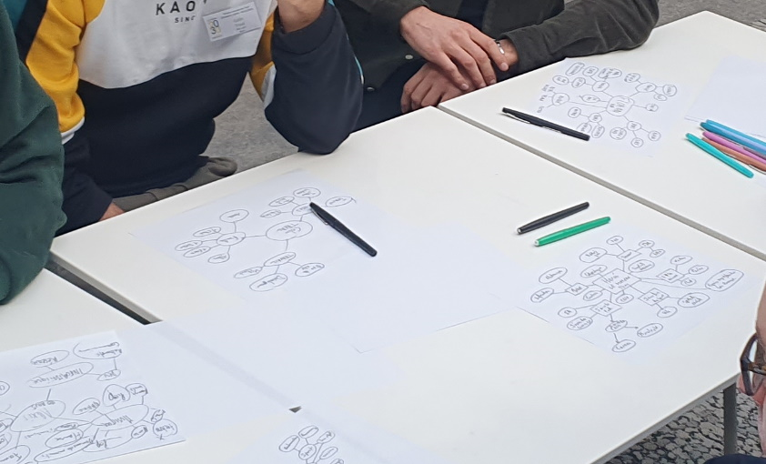

# PERSONAL MAP

**Catégorie:** Briser la glace · **Phase:** Ouverture · **Difficulté:** Facile · **Durée:** 30' · **Participants:** <10

## Objectif

Partager et découvrir des aspects personnels et professionnels de chacun

## Valeur ajoutée

Favoriser la création d'empathie sur ses collègues et renforcer les relations et la compréhension mutuelle au sein de l'équipe.

## Résumé de la pratique

Créer une carte personnelle d'un collègue pour apprendre davantage sur ses centres d'intérêts en s'inspirant des cartes mentales

## Materiel

- Feuille de papier vierge
- feutres de couleur

## Déroulé de l'atelier

### Préparer la map *(5')*
Chaque participant commence par prendre une feuille et inscrire son nom au milieu.

Autour de ce nom, chacun est invité à noter diverses catégories qui l'intéressent et qu'il souhaite partager avec le groupe, telles que son lieu de résidence, sa formation, sa vie pro, ses loisirs, sa famille, ses amis, ses objectifs personnels , ses valeurs...

### Compléter la map *(25')*

## Variante

Demandez à chaque participant de concevoir de manière autonome sa propre Personal Map. Une fois terminée, chaque personne aura l'occasion de présenter et d'expliquer sa carte mentale au reste du groupe. Vous pouvez aussi introduire une dynamique de jeu en invitant les participants à insérer un mensonge dans leur carte. Le défi pour les autres membres de l'équipe sera alors de détecter cet élément intrus.

## Source

Management 3.0 - Jurgen Appelo

---

📄 [Télécharger la fiche pratique (PDF)](https://atelier-collaboratif.com/fiche-pratique-79-personal-maps.pdf)

🔗 [Voir sur L'Atelier Collaboratif](https://atelier-collaboratif.com/79-personal-maps.html)