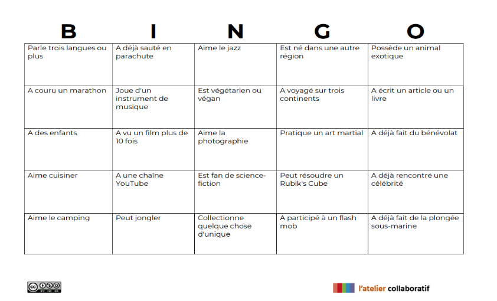

# BINGO HUMAIN

**Catégorie:** Briser la glace · **Phase:** Ouverture · **Difficulté:** Facile · **Durée:** 30' · **Participants:** 20-100

## Objectif

Encourager l'interaction entre les participants permettant à chacun de mieux se connaître de manière ludique et dynamique.

## Valeur ajoutée

Activité idéale pour dynamiser un groupe et créer des liens rapidement, en découvrant des faits amusants et intéressants sur les autres participants dès le début d'une session.

## Résumé de la pratique

Chaque participant reçoit une grille de bingo avec des affirmations ou des caractéristiques diverses (par exemple, "a visité plus de cinq pays", "parle trois langues"). Ils doivent ensuite trouver des personnes dans la salle qui correspondent à ces descriptions et obtenir leurs signatures pour compléter une ligne ou toute la grille.

## Materiel

- Feuilles de papier A4 pour les fiches.
- Feutres.

## Déroulé de l'atelier

### Introduction *(5')*
Le facilitateur explique les règles du Bingo Humain. Chaque participant reçoit une grille de bingo contenant des affirmations diverses qui concernent des traits de caractère, des expériences ou des préférences personnelles.

un exemple de grille de BINGO ici

Expliquer l'objectif : trouver des personnes qui correspondent aux descriptions dans leur grille de bingo.

### Déroulement du jeu *(20')*
Les participants se déplacent librement dans la salle, interagissent entre eux et posent des questions en rapport avec les affirmations sur leur grille.

Lorsqu'un participant trouve une personne correspondant à une affirmation, il demande à cette personne de signer dans la case correspondante de sa grille.

Le participant continue jusqu'à compléter une ligne (horizontale, verticale ou diagonale) ou, selon les variantes du jeu, toute la grille.

### BINGO!
Dès qu'un participant complète une ligne, il doit crier "Bingo !" pour informer les autres. Le jeu peut continuer jusqu'à ce que quelqu'un remplisse toute sa grille, selon les instructions initiales.

Le facilitateur vérifie rapidement la grille pour s'assurer que les signatures correspondent aux affirmations

### Débriefing *(10')*
Une fois qu'un ou plusieurs gagnants sont déclarés (première ligne ou grille complète), le facilitateur rassemble tout le monde pour un débriefing.

Discuter de l'expérience : Qu'ont-ils appris de nouveau ? Y a-t-il eu des surprises ? Comment se sont-ils sentis pendant l'activité ?

## Astuce

**Thématique spécifique** :  Adapter les affirmations sur les grilles à la thématique de l'atelier ou aux intérêts spécifiques du groupe (professionnel, loisirs, compétences uniques, etc.).

**Récompenses** :  Offrir un petit prix pour les premiers à compléter leur grille, ajoutant un élément compétitif à l'exercice

## A télécharger

Exemple de grille de BINGO au format Word

---

📄 [Télécharger la fiche pratique (PDF)](https://atelier-collaboratif.com/fiche-pratique-81-bingo-humain.pdf)

🔗 [Voir sur L'Atelier Collaboratif](https://atelier-collaboratif.com/81-bingo-humain.html)