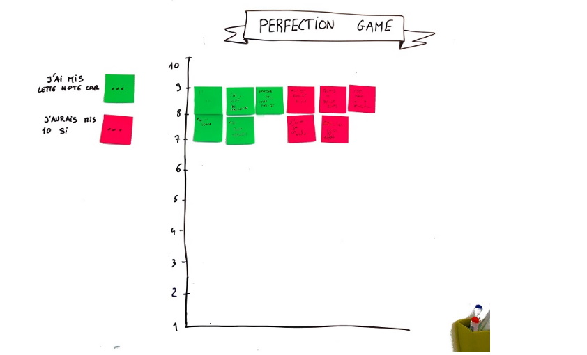

# PERFECTION  GAME

**Catégorie:** S'améliorer · **Phase:** Fermeture · **Difficulté:** Facile · **Durée:** 5' · **Participants:** >5

## Objectif

Récupérer du feedback d'un groupe afin d'améliorer un atelier ou une idée

## Valeur ajoutée

Pratique indispensable  afin de récolter la pertinence et les idées d'amélioration à la fin d'un atelier.

	Pratique pour l'évaluation à chaud d'une formation.

## Résumé de la pratique

Le facilitateur invite chaque participant à:

- noter sur 10 l'idée ou l'atelier

- expliquer pourquoi il a mis cette note

- proposer des axes d'amélioration pour que la note soit maximale.

## Materiel

- Paper board
- Post-it de couleurs (rouges et verts si possible)
- Crayons pour chaque participant

## Déroulé de l'atelier

### Préparation
Préparer une feuille de paper board en dessinant un axe vertical avec 10 graduations voir photo Distribuer un post-it rouge et un post-it vert pour chaque participant Le demandeur du feedback peut être le facilitateur dans le cas d'un atelier ou tout autre personne s'il s'agit d'une idée ou d'une présentation sur un sujet donné.

### Vote / 10
Le facilitateur demande au groupe de noter l'atelier (ou l'idée) sur 10 . 1 etant la note minimale et 10 la note maximale. La note doit refléter le potentiel d'amélioration plutôt qu'une appréciation personnelle.

### J'ai mis cette note car..
Chaque participant est alors invité à écrire pourquoi il a mis cette note sur un post-it vert.

### J'aurais mis 10 si...
Chaque participant écrit alors sur un post-it de couleur rouge par exemple, l'idée qui une fois mise en oeuvre aurait permis d'avoir la note maximale. On demandera d'écrire une idée par post-it Les critiques doivent être positives ..

### Restitution
A tour de rôle, les participants peuvent alors coller leurs post-it en face de la graduation et lire les post-it. Le demandeur du feeback écoute alors les remarques sans discussion sauf pour clarification.

## Source

The Core Protocols (Jim et Michele McCarthy)

---

📄 [Télécharger la fiche pratique (PDF)](https://atelier-collaboratif.com/fiche-pratique-99-perfection-game.pdf)

🔗 [Voir sur L'Atelier Collaboratif](https://atelier-collaboratif.com/99-perfection-game.html)