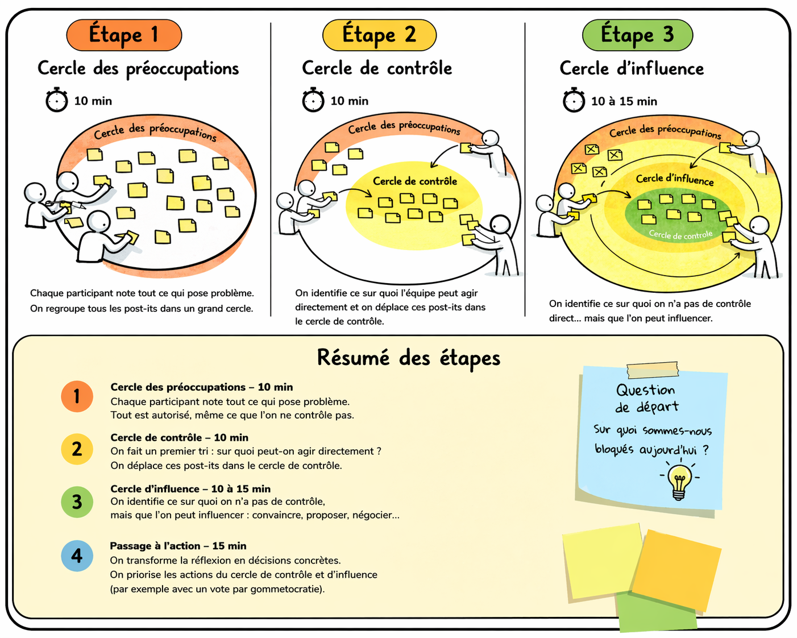

# CERCLE D'INFLUENCE

**Catégorie:** Résoudre des problèmes · **Phase:** Exploration Fermeture · **Difficulté:** Intermédiaire · **Durée:** 60' · **Participants:** 3-20

## Objectif

Rediriger l’énergie vers l’action utile plutôt que vers la frustration.

## Valeur ajoutée

Elle recentre l’équipe sur des actions concrètes et utiles, en réduisant la frustration et en renforçant la responsabilisation.

## Résumé de la pratique

Aider un groupe à sortir du blocage en distinguant :

- ce qu’il subit

- ce qu’il peut influencer

- ce sur quoi il peut agir immédiatement

## Materiel

- Paperboard
- Post-its
- Feutres

## Déroulé de l'atelier

### Étape 1 : poser le contexte *(5')*
Commencez par ancrer l’atelier dans une situation concrète. Par exemple, posez une question simple et directe du type :

### Étape 2 : cercle des préoccupations *(10')*

### Étape 3 : cercle de contrôle *(10')*

### Étape 4 : cercle d’influence 10-15 min

### Étape 5 : passage à l’action *(15')*
On termine en transformant la réflexion en décisions concrètes.

On peut prioriser les actions du cercle de contrôle et d’influence avec un vote par gommettocratie , par exemple.

## Source

Le principe vient de Stephen R. Covey

---

📄 [Télécharger la fiche pratique (PDF)](https://atelier-collaboratif.com/fiche-pratique-102-cercle-d-influence.pdf)

🔗 [Voir sur L'Atelier Collaboratif](https://atelier-collaboratif.com/102-cercle-d-influence.html)